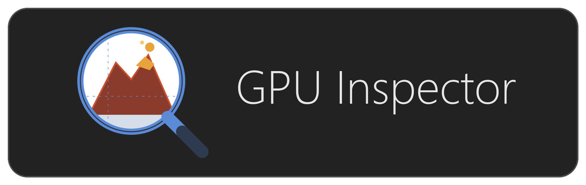

<p align="center"></p>

**GPU Inspector** is a cross-platform (Windows, Linux, macOS) graphics inspector for native applications, the native counterpart of [WebGPU Inspector](https://github.com/brendan-duncan/webgpu_inspector) (the web
version). Vulkan is the first supported API: every Vulkan call is intercepted through a layer, so
any application works without instrumentation, and Unity Vulkan players are the primary target.
The UI and protocol are API-neutral, and a second backend is now being written against them:
`metal/` captures Metal applications on macOS, injected with `DYLD_INSERT_LIBRARIES` rather than
registered as a layer. It inspects objects and captures frames today, but it is younger than the
Vulkan layer and does less — [macOS](#macos) has what works and what does not. Direct3D can
follow the same way. The feature list below describes the Vulkan layer.

* **Live object inspection** — every Vulkan object with its creation arguments, dependencies,
  labels, memory bindings and shader code (SPIR-V disassembly, GLSL, HLSL).
* **Validation messages** — enable the Khronos validation layer from the launch dialog and the
  errors and warnings it reports are listed in the Inspect tab, linked to the objects they name.
* **Shader editing** — edit a pipeline's shader as GLSL, HLSL or SPIR-V assembly, compile it with
  the Vulkan SDK's compilers and see the running application use it; restore the original at any
  time. Shaders compiled with debug information (`-g`, `-fspv-debug=vulkan-with-source`) show
  their embedded source, linked line by line to the SPIR-V, and are edited as that source.
* **Profiling** — GPU timestamps around every render pass and every run of compute dispatches
  of a capture: pass durations, a pass timeline, and a Frame Bound card comparing GPU and CPU
  submit time with the frame interval.
* **Frame capture** — the frame's command stream grouped by submit, command buffer, render pass
  and debug label. Each draw shows its pipeline state and shaders, every bound descriptor set
  with the parsed contents of its uniform and storage buffers and the images it sampled, the
  decoded vertex and index buffers, push constants and the pass's read-back render targets. Captures save to `.gpucap`
  files that reopen anywhere without the application, for bug reports and comparisons.
* **GPU bottlenecks** — every pass measured in the terms a bottleneck is described in: how many
  times each pixel is shaded, how large its triangles are, which stage it waits on and whether the
  depth test is rejecting work, each with what usually causes it. Both APIs; the counters come
  from a pipeline statistics query on Vulkan and Metal's counter sets on macOS.
  [docs/PROFILING.md](docs/PROFILING.md) is the walkthrough.
* **Replay** — a saved Vulkan capture is replayed on this machine's GPU, without the application,
  to answer what the capture alone cannot:
  - how many times each pixel was shaded (overdraw)
  - every draw that touched a pixel, and what became of its fragments (pixel history)
  - where one draw landed: highlighted, its depth test, its wireframe (draw overlays)
  - what the vertex shader wrote, as a wireframe and a table beside the vertices it read (mesh view)
  - each draw's GPU time and counters, for the Shader Flame Graph

  [docs/REPORTS.md](docs/REPORTS.md) shows each.
* **Render graph** — the same frame as a dependency graph: which pass produced what each pass
  reads, drawn as a resource lifetime chart with the selected pass's producers and consumers
  beside it, its GPU time and the frame's critical path, what it reads from before the capture,
  and which passes write something nothing reads.
* **Claude Code** — a plugin gives Claude the saved captures, read with the same analyses. Ask
  why a frame is slow or why an object is missing, and it follows a methodical path:
  - which pass is the bottleneck, and what bounds it
  - the draw involved, and the state it read
  - the render targets, returned as images
  - the uniforms, vertices and shaders

  See [Claude Code](#claude-code).

## Documentation

The user documentation is in [docs/](docs/README.md):

| | |
|---|---|
| [Install](docs/INSTALL.md) · [Getting started](docs/GETTING_STARTED.md) | the first session, start to a saved capture |
| [Vulkan](docs/VULKAN.md) · [Metal](docs/METAL.md) · [Android and Quest](docs/ANDROID.md) | the workflow for each platform |
| [Inspect](docs/INSPECT.md) · [Capture](docs/CAPTURE.md) · [Reports](docs/REPORTS.md) | using the inspector |
| [Finding GPU bottlenecks](docs/PROFILING.md) | working out what limits a frame |
| [Claude Code plugin](docs/MCP.md) | asking Claude about a capture |
| [Troubleshooting](docs/TROUBLESHOOTING.md) · [Building from source](docs/BUILDING.md) | when something does not work, and building it yourself |

[docs/ARCHITECTURE.md](docs/ARCHITECTURE.md) is the design and the current state of the project,
[TODO.md](TODO.md) is what is planned, and third-party code and licenses are listed in
[THIRD_PARTY_LICENSES.md](THIRD_PARTY_LICENSES.md).

## Install

Installers for each release are on the [releases page](https://github.com/brendan-duncan/gpu_inspector/releases):
`GPU-Inspector-Setup-<version>.exe` for Windows, `gpu-inspector_<version>_amd64.deb` for
Debian and Ubuntu (`sudo apt install ./gpu-inspector_<version>_amd64.deb`), and
`GPU-Inspector-<version>-arm64.dmg` or `-x64.dmg` for macOS (see [macOS](#macos) for what that
build does and does not do). Installed builds check
for updates at startup and offer to download them; the version label at the right of the launch
bar checks on demand. The installers contain the layer, so nothing below is needed unless you
want to build from source. What changed in each release is in [CHANGELOG.md](CHANGELOG.md), and
how releases are made in [docs/RELEASING.md](docs/RELEASING.md).

## Prerequisites

Linux and Windows need the same things: a C++20 compiler, CMake 3.20 or newer, Python 3.8 or newer
(the layer's source is generated from `vk.xml`), Node.js 18 or newer with npm (the Electron UI),
the windowing-system headers Vulkan's surface extensions include, and the shader tools `glslc`,
`spirv-dis` and `spirv-cross`. Where they come from differs per platform. macOS builds the Metal
capture library instead of the Vulkan layer and needs a shorter list.

### Linux

Everything is in the distribution's package repositories. On Debian/Ubuntu:

```
sudo apt install build-essential cmake ninja-build git python3 nodejs npm \
                 libvulkan-dev libxcb1-dev libx11-dev libwayland-dev \
                 glslc spirv-tools spirv-cross vulkan-tools
```

| Package | Needed for |
|---|---|
| `build-essential`, `cmake`, `ninja-build`, `git`, `python3` | building the Vulkan layer |
| `nodejs`, `npm` | building and running the Electron UI |
| `libxcb1-dev`, `libx11-dev`, `libwayland-dev` | serializing each windowing system's surface arguments; the layer builds without them but skips the ones that are missing |
| `libvulkan-dev`, `glslc` | the bundled test application (`vkinsp_triangle`) |
| `spirv-tools` (`spirv-dis`), `spirv-cross` | optional: shader text in the Inspect panel |
| `vulkan-tools` (`vulkaninfo`) | optional: checking that the Vulkan driver works |

You also need a Vulkan driver for your GPU: `mesa-vulkan-drivers` for AMD and Intel, NVIDIA's
proprietary driver (`nvidia-driver-<version>`) for NVIDIA. `vulkaninfo --summary` should list your
device. On other distributions the equivalent packages are `gcc-c++ cmake ninja-build python3
nodejs vulkan-loader-devel libxcb-devel libX11-devel wayland-devel glslc spirv-tools spirv-cross`
(Fedora) or `base-devel cmake ninja python nodejs npm vulkan-headers libxcb libx11 wayland shaderc
spirv-tools spirv-cross` (Arch).

`tools/setup.sh --check` reports which of these are missing and prints the install command for
your package manager, so you do not have to work the list out by hand.

The [LunarG Vulkan SDK](https://vulkan.lunarg.com/sdk/home#linux) is *not* required — it is an
alternative source for the same shader tools if your distribution's are too old.

### Windows

| What | Where |
|---|---|
| Visual Studio 2022 or newer, with the **Desktop development with C++** workload | https://visualstudio.microsoft.com/downloads/ |
| CMake 3.20+ — the C++ workload above installs one; standalone: | https://cmake.org/download/ |
| Python 3.8+ (tick **Add python.exe to PATH**) | https://www.python.org/downloads/ |
| Node.js LTS (includes npm) | https://nodejs.org/en/download |
| Vulkan SDK — supplies `glslc`, `spirv-dis`, `spirv-cross` and the loader the test app links against | https://vulkan.lunarg.com/sdk/home#windows |
| Git | https://git-scm.com/download/win |

The Windows SDK that comes with Visual Studio provides the windowing headers, and your GPU's
Vulkan driver comes with its normal graphics driver, so nothing extra is needed for either.

### macOS

| What | Where |
|---|---|
| Xcode command-line tools — the Objective-C++ compiler and the Metal framework headers | `xcode-select --install` |
| CMake 3.20+ | `brew install cmake`, or https://cmake.org/download/ |
| Node.js LTS (includes npm) | `brew install node`, or https://nodejs.org/en/download |

Nothing else: `layer/` does not build for Apple targets, so neither `vk.xml`'s Python generator
nor `glslc` is part of the build. `spirv-dis` and `spirv-cross` (`brew install spirv-tools
spirv-cross`) are still worth having, for the shader text of Vulkan captures taken on another
machine or on an Android device.

## Build and run

### Linux

```
git clone --recurse-submodules https://github.com/brendan-duncan/gpu_inspector.git
cd gpu_inspector
tools/setup.sh
cd app && npm start
```

Optionally, `tools/install_desktop_entry.sh` adds GPU Inspector to the desktop's application
list and dock (with its own icon rather than a placeholder), launching this checkout through
`tools/gpu-inspector`; `--uninstall` removes it.

`tools/setup.sh` checks the prerequisites, initializes the `Vulkan-Headers` submodule, builds the
layer and the test application into `build/bin`, and installs the app's node modules. It changes
nothing outside the checkout unless you pass `--install-deps`, which installs the missing system
packages first (using `sudo`). `--check` only reports what is missing, `--debug` builds the native
side as Debug.

To do the same by hand:

```
git submodule update --init
cmake -S . -B build -G Ninja -DCMAKE_BUILD_TYPE=Release
cmake --build build
cd app && npm install && npm start
```

### Windows

```
git submodule update --init
cmake -S . -B build -G "Visual Studio 17 2022" -A x64
cmake --build build --config Release
cd app && npm install && npm start
```

Use the generator name of the Visual Studio you installed (`"Visual Studio 18 2026"` for VS 2026).

### macOS

```
cmake -S . -B build -DCMAKE_BUILD_TYPE=Release
cmake --build build
cd app && npm install && npm start
```

No submodule, and a different CMake build: `layer/` has no Apple target, so the top-level
`CMakeLists.txt` builds `metal/` — the Metal capture library, `build/bin/libmtlinsp_capture.dylib`
— and the `mtlinsp_triangle` test application in its place. `tools/setup.sh` is Linux-only. See
[macOS](#macos) below for what the Metal side can and cannot do.

### Using it

Point the launcher at a Vulkan executable — for example the bundled test application,
`build/bin/vkinsp_triangle` (`build\bin\Release\vkinsp_triangle.exe` on Windows) — and press
**Launch**, then **Capture** in the Capture tab. On macOS the target is a Metal application
instead — `build/bin/mtlinsp_triangle`, or an `.app` bundle — and the rest is the same. The
inspector sets the capture environment variables for the process it launches, so nothing is
registered system-wide. The save button of
the capture bar writes the capture to a `.gpucap` file; **Open Capture...** (or dropping the file
on the window) reopens it later, on any machine, without the application.

Other useful commands, from `app/`:

```
npm run typecheck    # tsc
npm run watch        # rebuild the UI on change
npm run icons        # re-render assets/icon.{ico,png} from assets/icon.svg
npm run pack         # unpacked packaged app in app/release (needs the Release layer build)
npm run dist         # installer for this platform in app/release (see docs/RELEASING.md)
```

## Claude Code

The `gpu-inspector` plugin ([claude-plugin/](claude-plugin/README.md)) is an MCP server over saved
`.gpucap` files. It uses the same frame rules, bottleneck measurements, render graph, draw state
reconstruction, SPIR-V reflection and texture decoding as the app. Install it with:

```
claude plugin marketplace add brendan-duncan/gpu_inspector
claude plugin install gpu-inspector@gpu-inspector-plugins
```

Save a capture, then ask Claude about it, or use one of the plugin's commands:
- `/gpu-inspector:analyze`: a correctness and performance review.
- `/gpu-inspector:profile`: what limits the frame, following [docs/PROFILING.md](docs/PROFILING.md).
- `/gpu-inspector:debug <symptom>`: traces a rendering problem to the draw that causes it.
- `/gpu-inspector:compare <before> <after>`: whether a change moved the numbers.

Without a path, Claude picks from the captures GPU Inspector saved or opened recently. The plugin
needs Node.js 18 or newer, and neither the app nor the application being inspected has to be
running.

The plugin can also drive an application itself, with the capture library from this checkout's
build or from an installed GPU Inspector:
- launch it, and watch its frame rate
- capture frames
- replace a pipeline's shader while it runs, then capture again to measure the change

`/gpu-inspector:live <exe>` walks through it.

## Shader sources

Shaders compiled with source-level debug information (`-g` for glslc and glslangValidator,
`-fspv-debug=vulkan-with-source` for dxc) carry their text, and the Source view, the cost per
line and the findings' line links use it. A shader that carries line information only (dxc
`-Zi`, a build that strips the text) names its file instead: **Source roots** in the launch
dialog (directories, separated by `;`) tells the inspector where those files are on this
machine, and it reads them from there.

## Applications started elsewhere

An application the inspector cannot launch itself (an editor, a game behind its launcher) can
still be inspected: pick **An application started elsewhere (implicit layer)** under *Run On*
in the launch dialog and press **Register**. The layer is then registered for your user account
as an implicit layer (nothing is loaded anywhere until asked), and any application you start
with `VKINSP_ENABLE=1` and `VKINSP_PORT=<port>` in its environment loads it. Press **Wait** and
start the application; the session connects when it does (`VKINSP_LOG_FILE=<path>` writes the
layer's log to a file, since the inspector cannot read the output of a process it did not
start). For an editor started from a launcher, set the variables for your account (`setx` on
Windows) and restart the launcher. **Unregister** removes the registration. From the command
line: `npm start -- --wait-for-app --port=<port>`, and `--implicit-layer=on|off` switches the
registration.

## macOS

Applications on macOS render with Metal, and the Vulkan layer would see only the few that run on
MoltenVK — so a port of it was never the answer, and `layer/` does not build for Apple targets at
all. `metal/` is a Metal capture library that takes its place, loaded into the target with
`DYLD_INSERT_LIBRARIES`. It is newer than the Vulkan layer and does less, but the Inspect and
Capture panels both work against a Metal application today, over the same protocol and with no
separate UI of their own.

What works:

* **Object inspection** — the device, command queues, buffers, textures, libraries and render and
  compute pipeline states, each with the call that created it, its arguments and its label.
  Clicking a texture reads its pixels back live. A library lists its function names, and shows
  the Metal Shading Language it was compiled from when it was compiled here rather than loaded as
  a precompiled `metallib`.
* **Frame capture** — the frame's commands grouped by command buffer and pass, each draw with the
  pipeline bound at it, its decoded vertex and index buffers, and the pass's read-back colour
  attachments. Captures save to the same `.gpucap` files and reopen on any platform.
* **Android and saved captures** — unchanged from the Windows and Linux builds: Vulkan
  applications on Android devices over adb (see [Android](#android)), and `.gpucap` files taken
  anywhere.

What is not there yet: pass timings, so the profile view still sits at *"waiting for GPU
timestamps"*; depth attachments and sampled images are not read back, and only the pixel formats
`metal/src/formats.h` maps are (no ASTC, ETC or PVRTC); Metal's own validation layers are not
surfaced as validation messages; there are no creation stack traces; and shader editing does not
apply — it is built around SPIR-V and its compilers, and Metal's shaders are already source. Only
Apple Silicon has been verified. `metal/README.md` is the detailed account, including what the
interception itself cost to get right, and it keeps the current list.

### Injecting into an application

Metal has no loader and no layer mechanism — no manifests, no dispatch chaining, no supported
extension point. The library is inserted by dyld and interposes the C functions that hand out a
device, hooking the Objective-C classes it reaches from there. Choose **This computer** under
*Run On* in the launch dialog and pick the application's `.app` bundle: the inspector finds the
executable inside it (`CFBundleExecutable` — a directory cannot be spawned) and sets
`DYLD_INSERT_LIBRARIES` for that process alone, so nothing is registered system-wide.

**Code signing decides whether this is possible.** dyld silently drops `DYLD_*` for a process
with the hardened runtime unless it carries
`com.apple.security.cs.allow-dyld-environment-variables` and
`com.apple.security.cs.disable-library-validation`, which no notarized application does. The
inspector checks the signature with `codesign` *before* launching and reports it, rather than
leaving a session waiting for a connection that can never arrive; the message includes the
`codesign --force --sign - --entitlements ...` command that adds the two keys. A locally built
player — a Unity development build, the primary target here — is normally ad-hoc signed without
the hardened runtime and needs none of that.

Re-signing is deliberately not done for you: it rewrites the application bundle and invalidates
its signature and notarization, so it is something to do to a development build, not to a shipped
copy. This is the same shape as Android's requirement that the application be debuggable, and it
is the one place where "works with any uninstrumented application" does not carry over from
Windows and Linux.

An application the inspector cannot launch itself can still be started by hand with
`DYLD_INSERT_LIBRARIES=<path>/libmtlinsp_capture.dylib` and `MTLINSP_PORT=<port>` in its
environment (`MTLINSP_LOG=1` logs the intercepted calls to the session's Log tab), and attached
to with **Connect** or `npm start -- --connect=<port>`.

### Distribution

Releases are signed with the project's Apple Developer ID and notarized by Apple, so the `.dmg`
opens and the app runs without a Gatekeeper warning or any `xattr` incantation. Both
architectures are published: `-arm64` for Apple Silicon and `-x64` for Intel. The capture library
is packaged with the app, so an installed build needs no CMake step of its own.

A build you make yourself is a different matter: without a Developer ID certificate in the
keychain `npm run dist:mac` produces an ad-hoc signed app, which runs on the machine that built
it but is not something to hand to anyone else. It also needs the library built first —
`npm run pack` and `npm run dist` stage `build/bin/libmtlinsp_capture.dylib` into the app, or
`INSPECTOR_METAL_LIB` names it elsewhere.

Shader text for Vulkan captures — Android sessions, and `.gpucap` files from other machines —
still needs `spirv-dis` and `spirv-cross` (`brew install spirv-tools spirv-cross`, or the macOS
[Vulkan SDK](https://vulkan.lunarg.com/sdk/home#mac)). Nothing on the Metal path uses them.

## Android

Vulkan applications on Android devices (a Unity player built as a **Development Build**, for
example) can be inspected through adb. The same layer runs on the device; the inspector installs
it, starts the application with it enabled, and talks to it over an `adb forward` port.

What is needed, beyond the desktop prerequisites:

| What | Where |
|---|---|
| Android SDK with `platform-tools` (adb), `build-tools` and a `platforms/android-*` | Android Studio's SDK Manager, or `sdkmanager` from the command-line tools |
| Android NDK (r26 or newer) | SDK Manager, or `sdkmanager "ndk;26.3.11579264"` |
| A Java runtime, for signing the layer APK | `JAVA_HOME`, `java` on `PATH`, or the JDK bundled with Android Studio |
| A device running Android 9 or newer with USB debugging on, and a **debuggable** build of the application | Android only loads layers into debuggable applications (or on rooted devices) |

Build the Android layer once (it finds the SDK and NDK in `ANDROID_HOME`, `ANDROID_NDK_HOME` or
the default install location):

```
python tools/build_android.py            # arm64-v8a; add --abi arm64-v8a,x86_64 for an emulator
```

This produces `build/android/lib/<abi>/libVkLayer_inspector_capture.so` and
`build/android/gpu_inspector_layer.apk`, a layer package with no code of its own. Then choose
**Android device (adb)** under *Run On* in the launch dialog, pick the device and the package,
and press **Launch**. The inspector installs the layer APK when the device does not have this
version yet (Android 10+; on Android 9 it copies the library into the application's data
directory instead), enables Android's GPU debug layer settings for the package, starts it, and
connects. The Log tab shows the layer's logcat output. Closing the session turns the debug layer
settings off again. From the command line: `npm start -- --launch-android=<package>
--device=<serial>`.

`python tools/build_android_triangle.py` builds `build/android/android_triangle.apk`, a debuggable
test application for phones (a NativeActivity rendering a ring of triangles into a swapchain),
to launch the same way. For a headset, `python tools/build_xr_triangle.py` builds two debuggable OpenXR test
applications to launch the same way: `build/android/xr_triangle.apk` renders a ring of
triangles in one multiview pass, and `xr_triangle_slow.apk` ("XR Triangle (Slow)") renders the
same scene with deliberate inefficiencies, so the capture's **Frame Stats** (Frame Issues) and
**Analyze Shaders** reports have something to flag. The build needs the Vulkan SDK's `glslc`
and downloads the Khronos OpenXR loader on the first run. The headset must be worn (or its
proximity sensor covered) for the OpenXR session to start. "Symbol directories" in the launch
dialog names where the application's unstripped libraries are (its build tree, such as
`build/android/xr_triangle`): stack traces then show functions, files and lines, resolved with
the NDK's `llvm-symbolizer`.

Shader editing works as on the desktop: the shaders are compiled on this machine with the Vulkan
SDK's compilers and sent to the device. Expect the captured frame to take noticeably longer on a
tiled mobile GPU, since every render target is read back at the end of its pass.

## Testing

`python tools/ui_tests.py` runs the UI end to end against the built triangle application: a
plain capture, MSAA, frames without a present, a validation error and a synchronization hazard
linked to their commands, and stack traces with source lines. Each case starts the app through
the inspector, captures a frame, and checks what the renderer reports (`--debug-dump`) and the
layer's log. `--captures <dir>` also opens every `.gpucap` in a directory, checking a
`<name>.expect.json` next to it (`{"findings": {"rule": count}}`) when there is one. The
renderer's and the MCP server's unit tests run with `npm test` in `app/`. The triangle cases drive the Vulkan layer,
so on macOS only `--captures <dir>` applies; the Metal library has no automated test yet, and
`build/bin/mtlinsp_triangle` is run by hand (see `metal/README.md`).

## Troubleshooting

**"layer not found" when launching.** The app looks for `VK_LAYER_INSPECTOR_capture.json` in
`build/bin`, `build/bin/{Release,RelWithDebInfo,Debug}` and next to a packaged app. If your build
directory is somewhere else, point `INSPECTOR_LAYER_DIR` at the directory holding the manifest and
the layer library. On macOS it is the Metal capture library that is looked for in those same
places, and `INSPECTOR_METAL_LIB` points at the `.dylib` itself.

**macOS: the target starts but never connects.** Almost always the hardened runtime: dyld
dropped `DYLD_INSERT_LIBRARIES`, so the capture library was never loaded. The launch dialog
checks for this and refuses, so a target that got past it and still went quiet is worth
confirming with `codesign -d -v --entitlements - <the .app>`. Launch with **Log** on to see the
library's own output in the session's Log tab.

**The target starts but never connects.** The layer only loads if the Vulkan loader can find it;
run the target with `VK_LOADER_DEBUG=layer` to see the loader's search, and turn on **Log** in the
launch dialog to see the layer's own output in the session's Log tab.

**`TypeError: Cannot read properties of undefined (reading 'handle')` at startup.** Electron
started as plain Node because the terminal exported `ELECTRON_RUN_AS_NODE=1` — VS Code's
integrated terminal does. `npm start` clears it; running `npx electron .` directly does not, so
unset the variable in that case.

**The dock or task bar shows a generic icon (a gear on GNOME).** GNOME identifies a window by
its `WM_CLASS` (`gpu-inspector`) and takes the icon from the matching `.desktop` file, ignoring
the icon the window itself advertises. Run `tools/install_desktop_entry.sh` to install one.

**Electron fails to start on Linux with a sandbox or user-namespace error.** Recent distributions
(Ubuntu 23.10+) restrict unprivileged user namespaces, which Chromium's sandbox needs. Either
allow them for this binary, or start the app with `npx electron . --no-sandbox`.

**Android: the application starts but never connects.** Check the Log tab: `run-as` failing with
"not debuggable" means the build is not debuggable; nothing at all from `[vkinsp]` means the
loader did not pick the layer up (`adb logcat -s vulkan` shows its search). `adb shell settings
list global | grep gpu_debug` shows the settings the inspector wrote.

**Android: "adb not found".** Set `ANDROID_HOME` to the SDK, put `platform-tools` on `PATH`, or
point `INSPECTOR_ADB` at the adb executable. `INSPECTOR_ANDROID_LAYER_DIR` likewise overrides
where the Android layer is looked for (the directory holding `lib/<abi>/` and the APK).

**`vulkaninfo` reports no devices.** The Vulkan driver for your GPU is missing; see the driver
packages under Prerequisites. Nothing in the inspector will work until a driver is present.

**Shader text shows only SPIR-V bytes.** `spirv-dis` and `spirv-cross` were not found. Install
them, or point `INSPECTOR_TOOLS_DIR` at a directory containing them (`VULKAN_SDK` is searched too).
