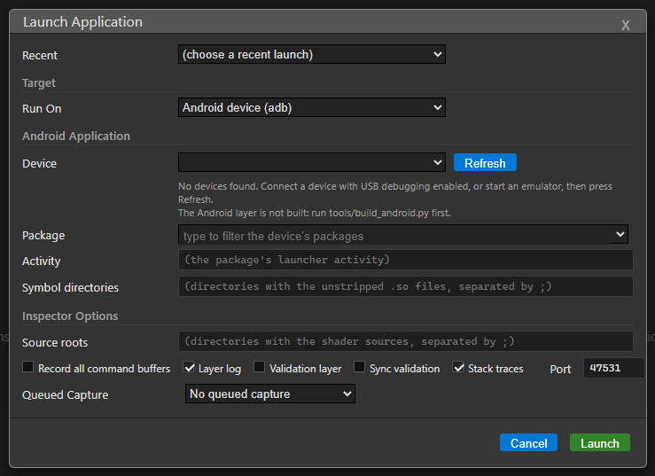

# Android and Quest

[Docs index](README.md) › Android and Quest

Vulkan applications on Android devices — phones, tablets and headsets such as the Quest — are
inspected over adb. The same Vulkan layer runs on the device: the inspector installs it, starts
the application with it enabled, and talks to it through an `adb forward` port. Everything else
works as it does on the desktop.

The host can be Windows, Linux or macOS.

## Requirements

| What | Where it comes from |
|---|---|
| Android SDK with `platform-tools` (adb), `build-tools` and a `platforms/android-*` | Android Studio's SDK Manager, or `sdkmanager` from the command-line tools |
| Android NDK, r26 or newer | SDK Manager, or `sdkmanager "ndk;26.3.11579264"` |
| A Java runtime, to sign the layer APK | `JAVA_HOME`, `java` on `PATH`, or the JDK bundled with Android Studio |
| A device running Android 9 or newer, with USB debugging on | |
| A **debuggable** build of the application | Android only loads layers into debuggable applications, or on rooted devices |

A Unity player built as a **Development Build** is debuggable, which is the usual way to get one.

## Build the Android layer

The released installers do not contain the Android layer — it needs the NDK — so build it once
from a [source checkout](BUILDING.md):

```
python tools/build_android.py            # arm64-v8a; add --abi arm64-v8a,x86_64 for an emulator
```

It finds the SDK and NDK in `ANDROID_HOME`, `ANDROID_NDK_HOME` or the default install location,
and produces:

- `build/android/lib/<abi>/libVkLayer_inspector_capture.so`
- `build/android/gpu_inspector_layer.apk` — a package with no code of its own that only carries
  the library

An installed GPU Inspector can use them too: set `INSPECTOR_ANDROID_LAYER_DIR` to the directory
holding `lib/<abi>/` and the APK.

## Launching

1. Connect the device and accept the USB debugging prompt on it.
2. Press **Launch...**, choose **Android device (adb)** under *Run On*.
3. Pick the device and the package. **Refresh** looks again (`adb devices`).
4. Leave *Activity* empty for the launcher activity, or give one as `com.example.Activity` or
   `.Activity`.
5. Press **Launch**.



The inspector then installs the layer APK when the device does not already have this version
(Android 10 and newer; on Android 9 it copies the library into the application's data directory
instead), turns on Android's GPU debug layer settings for that package, starts it, and connects.
The **Log** tab shows the layer's logcat output. Closing the session turns the debug layer
settings off again.

From the command line: `npm start -- --launch-android=<package> --device=<serial>`.

### Symbol directories

**Symbol directories** in the launch dialog names the directories holding the application's
unstripped `.so` files — its build tree. Stack traces then show functions, files and lines,
resolved on this machine with the NDK's `llvm-symbolizer`.

## Headsets (Quest and other OpenXR devices)

Headsets work the same way, with three differences worth knowing:

- **Frames without a present.** An OpenXR application never presents — the runtime composites
  its layers. The layer notices this after sixty submissions without a present and ends frames at
  the application's fence wait after a submission instead, so **Capture** still captures one
  frame. Multiview passes read back every layer in the view mask.
- **The headset must be awake and worn.** An OpenXR session stays idle until the headset is on a
  head, so the application will not render until then. Covering the proximity sensor does just as
  well.
- **Controllers.** The Quest shell refuses to launch an application until controllers or tracked
  hands are on, and the launch check dialog it leaves behind blocks later launches until the shell
  restarts. If launches start failing for no clear reason, take the headset off and back on.

After a launch, the inspector reads `dumpsys power` and `dumpsys window` and logs whichever of
these is in the way.

## Performance while capturing

Expect the captured frame to take noticeably longer on a tiled mobile GPU: every render target is
read back at the end of its pass. This affects the frame being captured, not the frames around it.

## What works the same as the desktop

- The whole [Inspect](INSPECT.md) tab, including live texture readback.
- The whole [Capture](CAPTURE.md) tab and every [report](REPORTS.md).
- [Shader editing](INSPECT.md#editing-a-shader): shaders are compiled on this machine with the
  Vulkan SDK's compilers and sent to the device.
- Validation layers, when the Vulkan SDK's validation layer is present on the device.

## Test applications

Two debuggable test applications can be built and launched the same way, to check the setup or to
see what the reports look like:

```
python tools/build_android_triangle.py   # build/android/android_triangle.apk, for phones
python tools/build_xr_triangle.py        # build/android/xr_triangle.apk + xr_triangle_slow.apk
```

`xr_triangle.apk` renders a ring of triangles in one multiview pass. "XR Triangle (Slow)" renders
the same scene with deliberate inefficiencies — a pass per eye, a stored depth buffer, a draw and
a bind per triangle, a wasteful fragment shader — so **Frame Stats** and **Analyze Shaders** have
something to flag. The build needs the Vulkan SDK's `glslc`, and downloads the Khronos OpenXR
loader the first time.

## If it does not work

See [Troubleshooting](TROUBLESHOOTING.md#android).

---

Previous: [Metal](METAL.md) · [Docs index](README.md) · Next: [Inspect](INSPECT.md)
