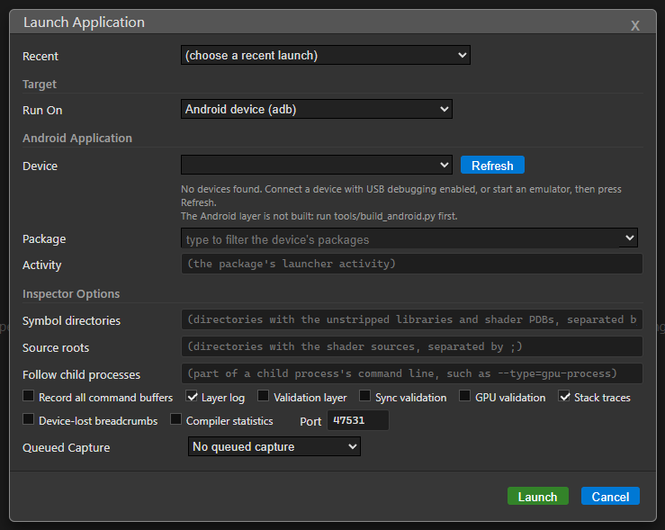

# Android and Quest

[Docs index](README.md) › Android and Quest

Vulkan applications on Android devices — phones, tablets and headsets such as the Quest — are
inspected over adb, and so are OpenGL ES applications, through the [OpenGL ES plugin](GLES.md#android). The same Vulkan layer runs on the device: the inspector installs it, starts
the application with it enabled, and talks to it through an `adb forward` port. Everything else
works as it does on the desktop.

The host can be Windows, Linux or macOS.

## Requirements

| What | Where it comes from |
|---|---|
| adb, from the Android SDK's `platform-tools` | Android Studio's SDK Manager, or `sdkmanager` from the command-line tools |
| A device running Android 9 or newer, with USB debugging on | |
| A **debuggable** build of the application | Android only loads layers into debuggable applications, or on rooted devices |

A Unity player built as a **Development Build** is debuggable, which is the usual way to get one.

## Build the Android layer

The released installers contain the Android layer for arm64-v8a devices, so an installed GPU
Inspector needs nothing built. A [source checkout](BUILDING.md) builds its own, and so does
anyone after another ABI, such as x86_64 for an emulator:

```
python tools/build_android.py            # arm64-v8a; add --abi arm64-v8a,x86_64 for an emulator
```

That needs more of the SDK:

| What | Where it comes from |
|---|---|
| `build-tools` and a `platforms/android-*` | Android Studio's SDK Manager, or `sdkmanager` |
| Android NDK, r26 or newer | SDK Manager, or `sdkmanager "ndk;26.3.11579264"` |
| A Java runtime, to sign the layer APK | `JAVA_HOME`, `java` on `PATH`, or the JDK bundled with Android Studio |

It finds the SDK and NDK in `ANDROID_HOME`, `ANDROID_NDK_HOME` or the default install location,
and produces:

- `build/android/lib/<abi>/libVkLayer_inspector_capture.so`
- `build/android/gpu_inspector_layer.apk` — a package with no code of its own, carrying only the
  library

An installed GPU Inspector can use them in place of its own: set `INSPECTOR_ANDROID_LAYER_DIR` to
the directory holding `lib/<abi>/` and the APK.

## Launching

1. Connect the device and accept the USB debugging prompt on it.
2. Press **Launch...**, choose **Android device (adb)** under *Run On*.
3. Pick the device and the package. **Refresh** looks again (`adb devices`).
4. Set *Graphics API* to what the application draws with: **Vulkan**, or **OpenGL ES** (Android
   10 and newer).
5. Leave *Activity* empty for the launcher activity, or give one as `com.example.Activity` or
   `.Activity`.
6. Press **Launch**.



The inspector then installs the layer APK when the device does not already have this version
(Android 10 and newer; on Android 9 it copies the library into the application's data directory
instead), turns on Android's GPU debug layer settings for that package, starts it, and connects.
A layer package signed with another key — each build machine signs with its own debug key, so a
release's differs from a source build's — is uninstalled first, since Android will not replace it.
The **Log** tab shows the layer's logcat output. Closing the session turns the debug layer
settings off again.

From the command line: `npm start -- --launch-android=<package> --device=<serial>`, with
`--api=gles` for an OpenGL ES application.

### Symbol directories

**Symbol directories** in the launch dialog names the directories holding the application's
unstripped `.so` files — its build tree. Stack traces then show functions, files and lines,
resolved on this machine with the NDK's `llvm-symbolizer`.

## Headsets (Quest and other OpenXR devices)

Headsets work the same way, with three differences worth knowing:

- **Frames without a present.** An OpenXR application never presents — the runtime composites
  its layers. The layer notices this after sixty submissions without a present and ends frames at
  the application's fence wait after a submission instead, so **Capture** still captures one
  frame. Multiview passes read back every layer in the view mask.
- **The headset must be awake and worn.** An OpenXR session stays idle until the headset is on a
  head, so the application will not render until then. Covering the proximity sensor does just as
  well.
- **Controllers.** The Quest shell refuses to launch an application until controllers or tracked
  hands are on, and the launch check dialog it leaves behind blocks later launches until the shell
  restarts. If launches start failing for no clear reason, take the headset off and back on.

After a launch, the inspector reads `dumpsys power` and `dumpsys window` and logs whichever of
these is in the way.

## Performance while capturing

Expect the captured frame to take noticeably longer on a tiled mobile GPU: every render target is
read back at the end of its pass. This affects the frame being captured, not the frames around it.

A phone shares its memory between the GPU and everything else, and Android ends an application that
takes too much of it. So a capture on Android reads back at most an eighth of the memory available
when it starts: half of that for render targets, a quarter each for sampled images and buffers, and
never more than the desktop's limits (512 MB of buffers, 256 MB of images). What does not fit is
reported as not captured, with the reason. On a Pixel 8 Pro with 6.4 GB available that is 772 MB:
386 MB of render targets, 193 MB each of images and buffers. To set the total yourself (in MB, on
any platform):

```
adb shell setprop debug.vkinsp.readback_mb 1024     # the environment variable VKINSP_READBACK_MB elsewhere
```

## What works the same as the desktop

- The whole [Inspect](INSPECT.md) tab, including live texture readback.
- The whole [Capture](CAPTURE.md) tab and every [report](REPORTS.md).
- [Shader editing](INSPECT.md#editing-a-shader): shaders are compiled on this machine with the
  Vulkan SDK's compilers and sent to the device.
- Validation layers, when the Vulkan SDK's validation layer is present on the device.

## Test applications

Debuggable test applications can be built and launched the same way, to check the setup or to
see what the reports look like:

```
python tools/build_android_triangle.py        # build/android/android_triangle.apk, for phones
python tools/build_android_gles_triangle.py   # build/android/android_gles_triangle.apk, OpenGL ES 3.2
python tools/build_xr_triangle.py             # build/android/xr_triangle.apk + xr_triangle_slow.apk
```

`android_triangle.apk` renders a ring of triangles in one instanced draw, and was checked on a Pixel 8
Pro (Mali-G715): it launches with the layer, a live session shows its frames at 120 Hz with no
validation messages, and a capture replays on a desktop NVIDIA GPU with every analysis working. The
replay differs from the capture only where two triangles of the ring overlap in one plane, a depth tie
the two GPUs break differently.

`xr_triangle.apk` renders a ring of triangles in one multiview pass. `xr_triangle_slow.apk`
renders the same scene with deliberate inefficiencies — a pass per eye, a stored depth buffer, a draw and
a bind per triangle, a wasteful fragment shader — so **Frame Stats** and **Analyze Shaders** have
something to flag. The build needs the Vulkan SDK's `glslc`, and downloads the Khronos OpenXR
loader the first time.

## If it does not work

See [Troubleshooting](TROUBLESHOOTING.md#android).

---

Previous: [Metal](METAL.md) · [Docs index](README.md) · Next: [Inspect](INSPECT.md)
