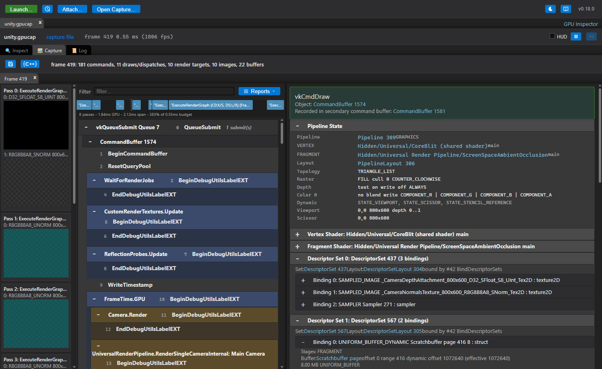
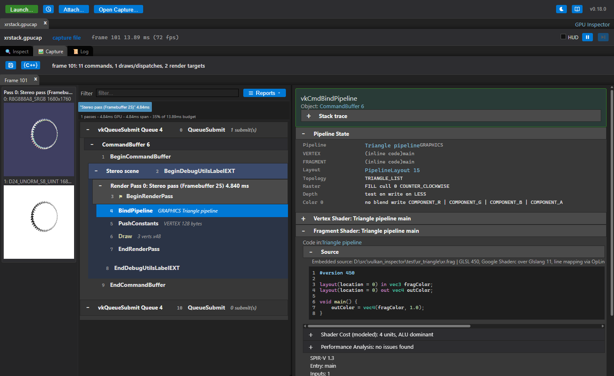

# Capture

[Docs index](README.md) › Capture

The **Capture** tab records frames and shows what was in them. Each capture opens in its own tab
and stays there until you close it, so several captures can be compared side by side.

## Taking a capture

Press **Capture**. The application's next frame is recorded and opens in a new tab.

The bar above it controls what is recorded:

| Control | What it does |
|---|---|
| **Frames** | How many consecutive frames to capture. Each gets its own list inside the tab |
| **At frame** | Capture that frame number instead of the next one (0 is the first frame the inspector sees). Leave it empty for the next frame |
| **Render targets** | Read back each render pass's attachments at the end of the pass |
| **Buffers** | Read back the buffers bound by descriptor sets, vertex and index bindings, and indirect draws |
| **Images** | Read back the images bound by descriptor sets, so the capture shows what the shaders sampled |
| **Profile passes** | Write GPU timestamps around every render pass: pass durations, the pass timeline and the Frame Bound card |
| **Stack traces** | Record the call stack of every command in the frame. Costs CPU time in the application while capturing |
| **Max KB** | Bytes captured per bound buffer range. Longer ranges are truncated |

On macOS there are also **Overdraw** and **Xcode Trace**; see [Metal](METAL.md#metal-only-capture-options).

Turning off what you do not need makes a capture smaller and faster, which matters most on mobile
GPUs. Leaving everything on is the right default on a desktop.

To catch a frame that goes by before you can press anything, use **Queued Capture** in the launch
dialog — it captures automatically as soon as the application connects.

## Reading the frame

The left side is the frame's commands, grouped by submit, command buffer, render pass and the
application's own debug labels. **Filter** narrows the list to matching commands.

Selecting a command fills the right side with everything that was true at that point in the frame:

- **Arguments** — the call and its parameters.
- **Pipeline State** — the whole graphics or compute state bound at that draw: shaders, blend,
  depth and stencil, rasterization, vertex layout, viewport and scissor.
- **Shaders** — the code of each stage bound at the draw, with reflection and embedded source, as
  in the [Inspect tab](INSPECT.md#shaders).
- **Descriptor sets** — every set bound at the draw and what each binding held, with buffers
  decoded into the types the shader declares. **Format** lets you override the type, and
  **Radix** the base.
- **Vertex and index buffers** — decoded into the attributes the pipeline declares, with their
  values.
- **Push constants**.
- **Render targets** — the pass's attachments as they were at the end of the pass. Clicking one
  opens the image viewer, with zoom, mip and layer selection, and the value of the texel under the
  pointer.
- **Stack trace** — where the command was recorded, when stack traces were captured.
- Commands recorded into a secondary command buffer say so, and link to it.

Anything the frame's analysis flagged about a command is shown with it, linked to the full list in
[Frame Stats](REPORTS.md#frame-stats).

## Reports

The **Reports** menu answers questions about the whole frame instead of one command: Frame Stats,
Analyze Shaders, Shader Flame Graph, GPU Bottlenecks, Render Graph and Overdraw. See
[Reports](REPORTS.md).

## Capture files

The save button writes the active tab to a `.gpucap` file. The file holds everything the tab
shows — commands, state, shaders, buffer and image contents, timings and stack addresses — so it
reopens on any machine, on any platform, without the application and without the layer.

- **Open Capture...** in the launch bar opens one, and so does dropping the file on the window.
- A capture file opens as its own session. Its objects are still browsable in the **Inspect**
  tab; what is gone is capturing more frames and reading anything back live, since there is no
  application behind it.
- Tab right-click has **Save Capture...**, **Open in New Tab**, **Open in New Window** and the
  close commands. Opening two captures in two windows is how a before-and-after comparison is
  made by eye; [Claude](MCP.md) can compare them numerically.

Captures are what to attach to a bug report, and what Claude reads.

---

Previous: [Inspect](INSPECT.md) · [Docs index](README.md) · Next: [Reports](REPORTS.md)
