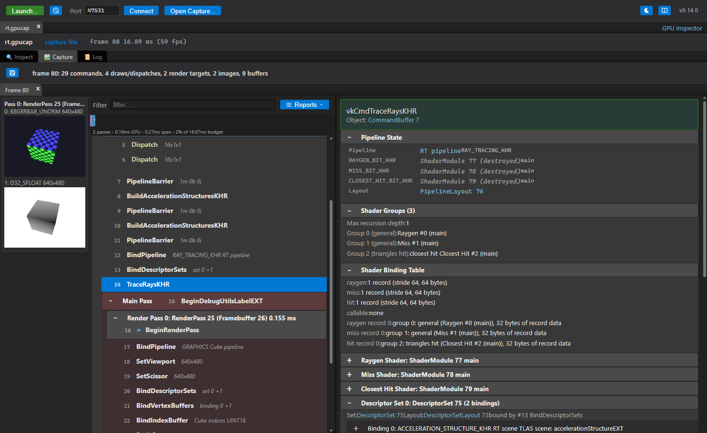

# Capture

[Docs index](README.md) › Capture

The **Capture** tab records frames and shows what was in them. Each capture opens in its own tab
and stays there until you close it, so several captures can be compared side by side.

## Taking a capture

Press **Capture**. The application's next frame is recorded and opens in a new tab.

The bar above it controls what is recorded:

| Control | What it does |
|---|---|
| **Frames** | How many consecutive frames to capture. Each gets its own list inside the tab |
| **At frame** | Capture that frame number instead of the next one (0 is the first frame the inspector sees). Leave it empty for the next frame |
| **Render targets** | Read back each render pass's attachments at the end of the pass |
| **Buffers** | Read back the buffers bound by descriptor sets, vertex and index bindings, and indirect draws, and the source of every buffer copy |
| **Images** | Read back the images bound by descriptor sets, so the capture shows what the shaders sampled, and what the frame found in the images it reads before writing them (a pass that loads an attachment, a copy from an image), so a [replay](REPLAY.md) can start where the frame did |
| **Profile passes** | Write GPU timestamps around every render pass: pass durations, the pass timeline and the Frame Bound card |
| **Stack traces** | Record the call stack of every command in the frame. Costs CPU time in the application while capturing |
| **Max KB** | Bytes captured per bound buffer range. Longer ranges are truncated |
| **Timing Capture** | Not a frame capture: records *every* frame's time and where its CPU went, for as long as you leave it running, and reports the hitches with what caused each. See [a hitch, rather than a slow frame](PROFILING.md#step-1c-a-hitch-rather-than-a-slow-frame). Vulkan only |

On macOS there are also **Overdraw** and **Xcode Trace**; see [Metal](METAL.md#metal-only-capture-options).

Turning off what you do not need makes a capture smaller and faster, which matters most on mobile
GPUs. Leaving everything on is the right default on a desktop.

To catch a frame that goes by before you can press anything, use **Queued Capture** in the launch
dialog — it captures automatically as soon as the application connects.

## Reading the frame

The left side is the frame's commands, grouped by submit, command buffer, render pass and the
application's own debug labels. **Filter** narrows the list to matching commands.

Selecting a command fills the right side with everything that was true at that point in the frame:

- **Arguments** — the call and its parameters.
- **Pipeline State** — the whole graphics or compute state bound at that draw: shaders, blend,
  depth and stencil, rasterization, vertex layout, viewport and scissor.
- **Shaders** — the code of each stage bound at the draw, with reflection and embedded source, as
  in the [Inspect tab](INSPECT.md#shaders).
- **Descriptor sets** — every set bound at the draw and what each binding held, with buffers
  decoded into the types the shader declares. **Format** lets you override the type, and
  **Radix** the base. A set bound through a descriptor buffer (`VK_EXT_descriptor_buffer`) reads the
  same way: the descriptors are driver-defined bytes in the application's own memory, and the layer
  decodes them by keeping every descriptor it saw the application ask the driver to make. One it
  never saw made — built before the inspector attached — is shown as unread rather than guessed at.
- **View Mesh** (a draw) — the draw's mesh in a tab of its own, as a wireframe and a table: the
  vertices it read, and what its vertex shader wrote. See [Mesh view](REPORTS.md#mesh-view).
- **Debug Vertex**, **Debug Pixel** (a draw) and **Debug Invocation** (a dispatch) — step through
  the shader on the command's inputs. See [Shader debugger](REPORTS.md#shader-debugger).
- **Vertex and index buffers** — decoded into the attributes the pipeline declares, with their
  values.
- **Push constants**.
- **Shader Groups** (a ray tracing pipeline) — the groups the pipeline was made with, each naming
  the shaders in it.
- **Shader Binding Table** (a trace) — which shader group each record of the table runs. A trace
  does not name the shaders it runs: it names four regions of memory whose records each begin with
  an opaque handle the driver gave out for a group. The layer keeps those handles on the pipeline
  and reads the table back from the addresses the trace points at, so each record is matched to its
  group, and the bytes after the handle are reported as the application's own shader record data.
  A record whose handle this pipeline never gave out is called out: a table filled from another
  pipeline, or from handles fetched before the pipeline was rebuilt, sends rays to the wrong shader
  or to none, and nothing else in a capture would show it. The structures a trace runs against are
  in the [Inspect tab](INSPECT.md#acceleration-structures).
- **Render targets** — the pass's attachments as they were at the end of the pass. Clicking one
  opens the image viewer, with zoom, mip and layer selection, and the value of the texel under the
  pointer. **Open in Tab** shows the target in the
  [render target tab](REPORTS.md#the-render-target-tab), where a pixel's history is one click and the
  pass's overdraw or a draw's overlays can be drawn over the image; a draw's targets also have
  **Highlight Draw**.
- **Stack trace** — where the command was recorded, when stack traces were captured.
- Commands recorded into a secondary command buffer say so, and link to it.

Anything the frame's analysis flagged about a command is shown with it, linked to the full list in
[Frame Stats](REPORTS.md#frame-stats).

## Reports

The **Reports** menu answers questions about the whole frame instead of one command: Frame Stats,
Analyze Shaders, Shader Flame Graph, GPU Bottlenecks, Render Graph and Overdraw. Pixel history,
draw overlays, the mesh view and the shader debugger answer questions about one pixel or one draw. See
[Reports](REPORTS.md).

Overdraw, pixel history, draw overlays, the mesh view's VS Out, the shader debugger's pixels and **Measure draws** replay a Vulkan
capture on this machine's GPU with `vkinsp_replay`, which the Windows and Linux installers include. The application
does not need to be running; see [Capture replay](REPLAY.md). A [Direct3D 12](D3D12.md) capture has no
replay, so these are not offered for it; a [Metal](METAL.md) capture measures overdraw and pixel history while capturing.

## Capture files

The save button writes the active tab to a `.gpucap` file. The file holds everything the tab
shows — commands, state, shaders, buffer and image contents, timings and stack addresses — so it
reopens on any machine, on any platform, without the application and without the layer.

- **Open Capture...** in the launch bar opens one, and so does dropping the file on the window.
- A capture file opens as its own session. Its objects are still browsable in the **Inspect**
  tab; what is gone is capturing more frames and reading anything back live, since there is no
  application behind it.
- Tab right-click has **Save Capture...**, **Export to C++...**, **Open in New Tab**, **Open in
  New Window** and the close commands. Opening two captures in two windows is how a before-and-after comparison is
  made by eye; [Claude](MCP.md) can compare them numerically.

Captures are what to attach to a bug report, and what Claude reads.

### Export to C++

The button beside save, **Export to C++**, writes a Vulkan, Direct3D 12 or Metal capture as a standalone
C++ project instead: a CMake project that re-creates the frame's objects, uploads what its images and buffers
held, records and submits its command buffers, and compares every render target with the capture's
copy. It is what to send a GPU vendor with a driver bug, who wants something to build and run
rather than a capture in a format of ours.

- It asks where the project's folder should go, and names the folder after the capture.
- The capture is replayed on this machine's GPU to write it, so it takes a moment, and the source
  is what the replay did: the project's `README.md` says how that differs from the application,
  and lists anything left out.
- The project needs CMake and a C++20 compiler and nothing else. It carries the Vulkan headers it
  was written against.

[Capture replay](REPLAY.md#export-to-c) has the details. Metal and D3D12 captures do not replay,
so they are not exported.

---

Previous: [Inspect](INSPECT.md) · [Docs index](README.md) · Next: [Reports](REPORTS.md)
