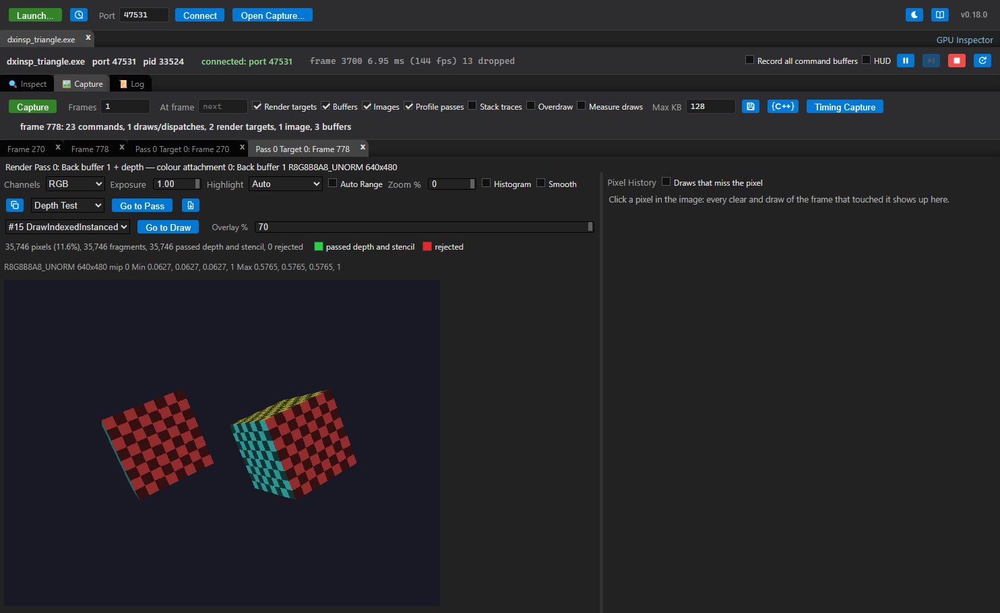
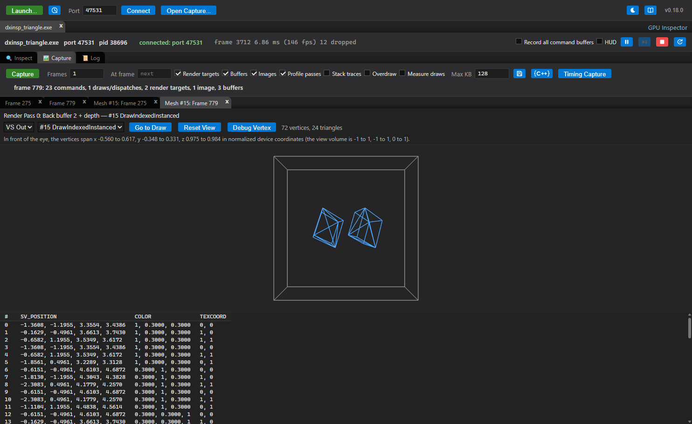

# Direct3D 12 (Windows)

[Docs index](README.md) › Direct3D 12

On Windows the inspector also captures Direct3D 12 applications. D3D12 has no layer mechanism,
so a capture library is injected into the application as it starts and hooks the D3D12 and DXGI
objects from there. The Inspect and Capture tabs work the same way as they do for Vulkan, and a
capture saves to the same `.gpucap` files.

D3D12 support is newer than the Vulkan layer and does less; [what is not there
yet](#what-is-not-there-yet) has the current list, and `src/d3d12/README.md` the details.

## Launching an application

Press **Launch...**, keep *Run On* on **This computer**, choose the executable and press
**Launch** — exactly as for a [Vulkan](VULKAN.md) application. There is nothing to choose: every
Windows target is started with the Vulkan layer enabled *and* the D3D12 library injected, and
whichever API the application uses connects. A Vulkan application never calls into the injected
library; a D3D12 application never loads the layer.

The dialog's options apply to both APIs. For D3D12: **Layer log** logs the intercepted calls to
the session's **Log** tab, **Validation layer** enables the D3D12 debug layer before the device is
created, **Stack traces** records where each object was created, **Record all command buffers**
records every command list whether or not a capture is in progress (for lists recorded once and
executed every frame), and **Source roots** names the directories holding the HLSL sources of
shaders compiled with line information only.

Behind the button, the inspector runs `dxinsp_launch.exe`, which creates the application
suspended, loads `dxinsp_capture.dll` into it, runs the library's initialization — hooking
`D3D12CreateDevice` and the `CreateDXGIFactory` entry points — and only then lets the
application's first instruction run. That covers a device made in a static initializer, a
`LoadLibrary` of `d3d12.dll` (Unity), and the Agility SDK. The **Log** tab shows a line naming the
library that was injected, or the launcher's reason it could not be.

The inspector looks for `dxinsp_capture.dll` and `dxinsp_launch.exe` where it looks for the
Vulkan layer: next to a packaged app, and in `build/bin` and
`build/bin/{Release,RelWithDebInfo,Debug}` of a source checkout. `INSPECTOR_D3D12_DIR` points at the
directory when the build is elsewhere.

## Starting an application by hand

An application the inspector cannot launch itself can be started through the launcher with the
library's variables set, then picked up with **Connect** (or `npm start -- --connect=<port>`):

```
set DXINSP_PORT=47531
dxinsp_launch.exe --dll <path>\dxinsp_capture.dll -- app.exe [arguments]
```

| Variable | Value |
|---|---|
| `DXINSP_PORT` | the port to connect on (default 47531) |
| `DXINSP_LOG` | optional: `1` logs the intercepted calls to the session's **Log** tab |
| `DXINSP_LOG_FILE` | optional: a path the log is appended to, since a GUI application has no stderr |
| `DXINSP_STACKTRACES` | optional: `1` takes a stack trace at every object creation |
| `DXINSP_RECORD_ALWAYS` | optional: `1` records every command list, not only those recorded during a capture |
| `DXINSP_DEBUG_LAYER` | optional: `1` enables the D3D12 debug layer before the device is created |
| `DXINSP_NO_DRED` | optional: `1` leaves Device Removed Extended Data off, which is otherwise enabled before the device is created ([Troubleshooting](TROUBLESHOOTING.md)) |
| `DXINSP_FRAME_BOUNDARY` | optional: `submit` ends frames at every `ExecuteCommandLists` and ignores presents, `present` never does (for a renderer that draws without presenting, below) |

`--cwd <dir>` sets the application's working directory. The launcher waits for the application
and exits with its exit code. A target it cannot inject into (a 32-bit executable) is still
started, with the reason on stderr.

## Waiting for an application to start

For an application the inspector cannot start — a game behind its launcher or Steam, a Unity player
started from the editor — press **Launch...**, set *Run On* to **An application started elsewhere
(Direct3D 12)**, type the executable's name (`TestVulkan.exe`; a full path matches only that build)
and press **Wait**. Then start the application the way it is normally started. The inspector
watches the process list and injects `dxinsp_capture.dll` into the process the moment it appears,
freezing it until the library is in, so the hooks are installed before the application's first
Direct3D 12 call. From there the session is an ordinary one: the same Inspect and Capture tabs, the
same **Log** tab, and **Stop** ends the *watch* — never the application, which the inspector did not
start.

This is the Direct3D 12 counterpart of Vulkan's [implicit layer](VULKAN.md), which the loader can
be told to load into any process. D3D12 has no loader, so this races the application's start
instead, and its limits follow from that:

- **The wait has to be running before the application is launched.** An application that is
  *already running* cannot be caught: the library hooks `D3D12CreateDevice`, and a device made
  before the hooks were installed is invisible to it — D3D12 has no way to find a device that
  already exists. The **Log** tab says how old the process was when the library went in and warns
  when that was more than a second.
- The library opens its port only when a device is created, so a session that says it injected and
  then stays on *connecting* means one of two things: the application does not use Direct3D 12, or
  it had its device already. The log says so after ten seconds and keeps waiting.
- Only x64 processes are injected, and an application running elevated or as another user needs the
  inspector itself to run elevated.
- It is Direct3D 12 only: the Vulkan layer is a loader mechanism and is not involved. For Vulkan,
  use the implicit layer target beside this one.

The same thing on the command line, for an application started by hand:

```
dxinsp_launch.exe --watch TestVulkan.exe --dll <path>\dxinsp_capture.dll ^
                  --env DXINSP_PORT=47531 --once
```

`--watch` takes an image name or a full path, `--env NAME=VALUE` passes the variables of the table
above into a process that cannot inherit them (it was started by someone else), `--once` injects
into the first match and then waits for it and exits with its exit code, `--timeout <seconds>`
gives up (exit code 3) and `--poll <ms>` sets how often the process list is looked at (2 ms).
Then **Connect** to the port, or use `npm start -- --wait-for-d3d12=<image>` to do all of it in one
session. The MCP server has the same thing as `wait_for_app`.

## What works

- **Dropped frames, measured** — the swap chain's own `DXGI_FRAME_STATISTICS` counts the display
  refreshes that showed the previous frame again, so the figure beside the vsync rate is what the
  display did rather than what the frame times imply. The Vulkan layer has no equivalent and works
  its count out from the frame interval and the refresh period, so there the number is marked
  *(estimated)*. A swap chain that will not answer — a blit-model one, or one whose counters went
  disjoint across a mode change — reports nothing rather than a zero that looks like a measurement.
- **Object inspection** — adapters, devices, queues, allocators, command lists, resources,
  heaps, descriptor heaps, root signatures, pipeline states, fences, query heaps and command
  signatures, each with the call that created it, its descriptor under the D3D12 names
  (`pDesc`), and the name given with `SetName`. Clicking a texture reads its pixels back live. A
  descriptor heap lists what each written slot holds. The device shows the adapter's description,
  its feature level and its `CheckFeatureSupport` results.
- **Frame capture** — every command list executed during the frame, in submission order, with
  each call under its D3D12 name and arguments. Bundles are inlined where `ExecuteBundle` ran
  them. D3D12 has no render passes unless the application uses `BeginRenderPass`, so the capture
  groups commands into passes itself: `OMSetRenderTargets` begins one, and it ends at the next
  `OMSetRenderTargets` or at `Close`, where the capture records a synthetic `EndRenderTargets`
  command — the one command in the list the application did not make. A run of dispatches
  outside a render pass is a compute pass.
- **Render targets** — every color target and the depth target of each pass, read back at its
  end; multisampled targets are resolved first. Stencil is not read back.
- **Bound state at a draw** — the descriptor tables and root views bound at each draw or
  dispatch, with the buffers and textures they name read back (constant buffers decoded through
  the shader's reflection), root constants (shown as push constants), the vertex and index
  buffers with the pipeline's input layout, and the arguments of `ExecuteIndirect`.
- **Replay and Export to C++** — `dxinsp_replay` re-executes a capture on this machine's GPU and
  compares every render target with the capture's copy, and **Export to C++** in the capture bar
  (`export_cpp` from the MCP server) writes the frame as a standalone CMake project that does the
  same, for a driver bug report. A Unity frame replays identical
  ([Capture replay](REPLAY.md#direct3d-12)).
- **Pass timings and counters** — GPU time per pass, pipeline statistics (vertices, primitives,
  invocations) and the samples that passed the depth and stencil tests, which the Frame Stats
  and GPU Bottlenecks reports read. See [Finding GPU bottlenecks](PROFILING.md).
- **The CPU and GPU timeline** — during a capture the library times the host calls a frame spends
  its time in, so **Where the CPU went** and the **Timeline** card work the same as on Vulkan.
  Submitting and presenting are D3D12 calls and are timed in place; waiting for the GPU is not — a
  D3D12 fence is waited on with `WaitForSingleObject` on a Win32 event — so the library recognises
  the event a fence was given (`SetEventOnCompletion`) and the swapchain's frame-latency object, and
  times a wait on either. `GetClockCalibration` relates the GPU clock to the host's, which is what
  puts the passes on the same axis as the calls that submitted them.
- **Memory per heap** — the adapter's two memory segments (the GPU's own and the system memory it
  reaches over the bus), what this application has allocated from each through explicit heaps and
  committed resources, and what the driver says is resident and allowed
  (`IDXGIAdapter3::QueryVideoMemoryInfo`), on the adapter in the Inspect tab. A placed resource is
  not counted twice: the heap holding it already is.
- **Device-removed diagnostics** — see [Troubleshooting](TROUBLESHOOTING.md).
- **Validation** — with **Validation layer** ticked, the D3D12 debug layer's messages are listed
  in the Inspect tab, with repeat counts; on Windows 11 a message fired while recording a command
  list is linked to the command that caused it. Releasing the device reports what is still
  alive.
- **Stack traces** — for object creations (**Stack traces**) and for captured commands (the
  capture bar's switch), symbolized on request.
- **Shaders** — a pipeline's stages are shown as disassembly, and as HLSL when the source can be
  found: `dxc -Zi` embeds it in the container, and `dxc -Zs` keeps it out and writes it to a PDB
  beside the build (`-Fd <dir>\`), which GPU Inspector reads when a **Symbol directories** entry
  names that directory. The Reflection section lists constant buffers with their members,
  resources by register and space, inputs and outputs. DXBC needs nothing extra; DXIL needs
  `dxcompiler.dll` (see below).
- **Shader editing** — **Edit** on a stage, then **Compile & Apply** compiles the HLSL with `dxc`
  and the running application draws with the replacement from the next frame; a stage with no
  source anywhere opens on HLSL generated from its reflection — the same constant buffers at the
  same offsets, the same resources at the same registers and spaces, the same entry signature, so
  it compiles into a binding-compatible replacement with only its body invented; **Restore
  Original** puts its own pipeline back. A pipeline loaded from a pipeline library is editable
  too: the library only caches the driver's compiled blob under a name, and `LoadGraphicsPipeline`
  is still given the whole description, which is how Unity's D3D12 player loads every graphics
  pipeline.

## Renderers that do not present (WebGPU / Dawn)

This section is the mechanism; [Web pages and WebGPU](BROWSER.md) is the workflow — launching a
page, reading the capture it gives you, and what to do when it does not connect.

Not every D3D12 renderer presents to a swap chain. Chrome's GPU process runs WebGPU through Dawn,
whose D3D12 device renders into textures the browser compositor presents rather than presenting
itself, so the inspector never sees that device call `Present`. It falls back, as it does for an
OpenXR Vulkan application, to ending frames at the device's `ExecuteCommandLists` once it has gone
a while submitting without a present; the Capture panel then shows `frameBoundary: submit` and no
display refresh, and a capture is a full frame all the same.

Getting the library into Chrome's GPU process, which the browser spawns itself, is what the
launcher's **follow** mode is for: the browser is started normally and the launcher injects into
the children it spawns whose command line matches, the way PIX and RenderDoc attach.

The launch dialog does this for you. Choose **A web page in a browser (WebGPU)** under *Run On*,
pick the browser — the Chrome, Chrome Beta, Chrome Dev, Chrome Canary, Edge, Brave, Firefox and
Firefox Nightly installs found on this machine are listed with their versions — and type the page's
URL. The browser is started with its own profile (so the browser you already have open keeps its
windows, and a running browser does not take the page and leave nothing to capture), its GPU
sandbox off, and the library in its GPU process; the session connects as soon as the browser's
WebGPU implementation makes its device. `--launch-browser=<url>` (with `--browser=<name or path>`
when several are installed) is the same launch from the command line.

**Firefox works too, and differently in every particular** (`src/app/src/main/browsers.ts`). Its
WebGPU is wgpu rather than Dawn, whose Windows backend is Direct3D 12 as well, and it runs in
Firefox's GPU process; but that process is named by the type at the end of its command line, so the
pattern followed is `" gpu"` (with the space: a bare `gpu` also matches a profile path and would
inject into every tab). There is no switch for its GPU sandbox — it is a preference, so the launch
writes `security.sandbox.gpu.level = 0` into the profile it makes — and `-no-remote -profile <dir>`
is what keeps the page away from a Firefox already running. Firefox also starts the browser from a
first process that exits straight away, which is why following tracks the target's whole tree
rather than the process the launcher started. A Firefox capture is the easier one to read, as it
happens: naga keeps the entry point names of the page's WGSL (`vertexMain`), where Dawn mangles
them (`dawn_entry_point_66696c…`).

Underneath, it is an ordinary launch with the arguments and the follow patterns composed
(`src/app/src/main/browsers.ts`). For a browser that needs other switches, choose **This computer**
instead and fill the fields in yourself: `--type=gpu-process !--use-gl=disabled` in **Follow child
processes** and `--disable-gpu-sandbox` in the arguments. From a shell or the MCP server's
`launch_app` (its `follow` argument) it is:

```
dxinsp_launch.exe --dll <path>\dxinsp_capture.dll --follow --type=gpu-process ^
                  --follow !--use-gl=disabled ^
                  -- chrome.exe --disable-gpu-sandbox --disable-gpu-watchdog <url>
```

The GPU sandbox has to be off or the injected library cannot open its socket (nothing connects and
the library's log never appears), and the watchdog off so it does not kill the process while the
first capture runs. The second pattern is an exclusion: Chrome starts a second `--type=gpu-process`
to collect GPU information, which makes a device of its own and exits again, and leaving it alone
keeps the session's port with the process that renders. Chrome's own `--gpu-launcher` hook, which starts the GPU process through a
wrapper, does **not** work on current Chrome: a GPU process started that way exits within a
fraction of a second however it is wrapped — with no library involved at all — and the browser
respawns it in a loop.

If the compositor also presents on a hooked D3D12 device and steals the capture, set
`DXINSP_FRAME_BOUNDARY=submit` so presents are ignored for framing and Dawn's submissions delimit
the frames. `test/d3d12_triangle --offscreen` reproduces the never-presenting shape without Chrome.

Note this is the D3D12 view *beneath* WebGPU: it shows what a WebGPU frame became in D3D12, which
is a different and lower question than the page-level [WebGPU
Inspector](https://github.com/brendan-duncan/webgpu_inspector) answers.

## Overdraw and pixel history

Two of the analyses `vkinsp_replay` does for a Vulkan capture are measured here in the application
while it captures, the way the Metal library does them (`src/d3d12/src/overdraw.h`): they predate
`dxinsp_replay`, which replays a D3D12 capture but runs no analyses on it.

**Overdraw** is the capture bar's **Overdraw** switch (`capture_frames overdraw: true` from the MCP
server). Every render pass of the capture is issued a second time into the application's own command
list, right after the library has read the pass's render targets back, into an `R16_FLOAT` target of
the pass's size with every pipeline replaced by a copy whose pixel shader returns 1.0 and whose
blending is `ONE + ONE`: each pixel then holds how many fragments landed on it. Twice per pass --
against a copy of the depth-stencil attachment taken before the pass began and with the pipelines'
own depth-stencil state (the fragments that passed, in draw order), and with no depth-stencil
attachment and the tests off (every fragment rasterized). The pass's heatmap is in its details and
over its render target in the texture tab, the pass header and GPU Bottlenecks use the measured
figure, and `get_overdraw` returns it.

**Pixel history** is clicking a pixel in a render target's tab: the capture answers for the pixel it
was taken with, and offers to capture the next frame following another. Every render pass whose
colour attachment is that resource gets copies of its attachments, and after the application's pass
each draw is issued again over the copies with a one-pixel scissor, six times under occlusion
queries with pipeline copies that add one step each -- coverage, culling, the pixel shader (so a
discard shows), the depth test, the stencil test, both -- and then for real, with the pixel read
after every event. A swap chain's back buffer follows whichever one the next frame renders into.

What is not measured is reported rather than dropped: a draw whose pipeline has no copy (the
pipeline stream carries a subobject this library does not know, or its pixel shader holds the root
signature), an `ExecuteIndirect`'s draws, a pass that executes a bundle recorded before the capture,
a multisampled pass's depth and stencil tests, a layered pass's tests, and more than 1024 followed
draws in a pass. A capture with either measurement costs GPU and CPU time in the frame it takes, and
its draws sit between the application's render passes, so a `BeginRenderPass` chain that used
`PRESERVE_LOCAL_*` beginning accesses is broken for that frame.

## Measuring draws, overlays and meshes

Three of the measurements the Vulkan side gets by replaying a capture are taken here inside the
application instead, while the frame records. What that costs and what it means:

| Measurement | How to ask for it | What it measures |
|---|---|---|
| **Measure draws** | the capture bar's checkbox, before capturing | a timestamp pair, a pipeline statistics query and an occlusion query around every draw and dispatch, for the [Shader Flame Graph](REPORTS.md#shader-flame-graph)'s split of a pass between its draws |
| **Draw overlays** | an overlay in a [render target tab](REPORTS.md#the-render-target-tab) | where one draw landed: the fragments it rasterized, those that passed the depth and stencil tests, and its wireframe |
| **Mesh view's VS Out** | **View Mesh** on a draw | what the draw's vertex shader wrote, streamed out of the unmodified bytecode (`D3D12_STREAM_OUTPUT_DESC` over its output signature) |





Two consequences follow from the measurement happening in the application rather than in a replay,
and they are the same ones [Metal's pixel history](METAL.md) has:

- **The application has to be running**, and what is measured is its *next* frame. Asking for an
  overlay or a mesh captures again; that new capture is the one that opens, and the one the numbers
  belong to. A saved capture cannot be measured after the fact.
- **A draw is named by its pass and its ordinal within that pass**, not by the command index you
  clicked, since the frame captured next numbers its commands from the start. An engine that
  records the same frame differently each time can therefore measure a different draw than the one
  you picked; the report says which draw it measured.

One draw is measured per capture for an overlay or a mesh. Per-draw timings are for every draw at
once, and cost GPU and CPU time in the captured frame, so they are a capture option rather than
something asked for afterwards: the first 16,384 draws are measured and the message says how many
were left.

A command list recorded before the capture began carries none of these: the queries and the
re-issued draws go in as the list records. `DXINSP_RECORD_ALWAYS=1` records every list from the
start, which is what an engine that builds its lists several frames ahead (Unity does) needs.

## What is not there yet

- No **Timing Capture**: recording every frame's time and CPU split over minutes
  ([a hitch, rather than a slow frame](PROFILING.md#step-1c-a-hitch-rather-than-a-slow-frame)) is
  Vulkan only so far. The library already times the same categories, so what is missing is the
  per-frame ring and the message that carries it.
- Draw overlays, mesh output (VS Out) and per-draw timings are measured inside the application
  while the frame records, the way overdraw and the pixel history are (above), rather than by
  replaying the capture: see [Measuring draws, overlays and meshes](#measuring-draws-overlays-and-meshes).
- Hardware counters (**Measure hardware counters**) are read by replaying the capture with
  `dxinsp_replay`, as Vulkan reads them with `vkinsp_replay`: the frame is re-executed once per
  collection pass with a counter range around each render pass
  ([Capture replay](REPLAY.md#hardware-counters)). NVIDIA only — Direct3D 12 has no portable
  counter API — and the machine must allow GPU performance-counter access.
- What is still Vulkan-only: shader cost by ablation (**Measure shader**), which needs the shader
  edited and has no DXIL editor to do it with.
- No compiler statistics per pipeline. Vulkan asks the driver what its shader compiler made of each
  stage through `VK_KHR_pipeline_executable_properties`; D3D12 has no portable equivalent, so
  register counts, spills and occupancy are not available and the launch dialog's **Compiler
  statistics** stays Vulkan-only. DXIL reflection gives the signature and bindings, not the
  compiler's own numbers.
- The shader debugger steps a D3D12 shader as its HLSL compiled to SPIR-V by `dxc` (there is no
  DXIL interpreter), so it needs the source: a build with `-Zi`, or a `-Zs` build's PDB under the
  symbol directories. It is the same source the GPU ran, compiled the way the build compiled it,
  but not the same module, and nothing checks the two against each other. A shipped shader with
  no HLSL anywhere cannot be stepped, and the tab says so. Shader model 6.6 dynamic resources
  (`ResourceDescriptorHeap[]`) do not compile to SPIR-V.
- Stencil is not read back. Sampler feedback, video, work graphs and raytracing state objects
  are listed as objects and their commands recorded, but their contents are not read back.
  Enhanced barriers (`Barrier`) are followed only as far as their layouts map to the legacy
  states.
- A descriptor table set in a bundle before the bundle set its own root signature has contents
  only in a capture that executes the bundle, where the executing list's root signature reads it.
- Only x64 applications are injected; a 32-bit target runs without the library.
- No attaching to an application that is **already running**: the library hooks the entry points
  that create a device, and a device that already exists cannot be found afterwards. An application
  the inspector does not start is caught at its start instead (*waiting for an application to
  start*, above), which means the wait has to be running before the application is launched.
- DXIL reflection and disassembly need `dxcompiler.dll`, which the library looks for beside
  itself, in `%VULKAN_SDK%\Bin`, in the Windows SDK's `bin\<version>\x64` and on `PATH`. Without
  it a DXIL shader shows no text and its constant buffers are bytes. DXBC uses
  `d3dcompiler_47.dll`, which every Windows has.

## The test application

`test/d3d12_triangle` builds `dxinsp_triangle.exe`, the D3D12 counterpart of `vkinsp_triangle`:
two rotating textured cubes with a depth buffer, re-recording the command list every frame. It
has a swap chain, a root signature with a descriptor table (a constant buffer and a texture), root
constants and a static sampler, a graphics pipeline compiled with `dxc -Zi` so the
Source view has something to show, and a compute pipeline writing a UAV. Its options:

| Option | What it does |
|---|---|
| `--frames N` | exits after N presents (0, the default: until the window is closed) |
| `--width W`, `--height H` | the window's client size (640x480) |
| `--msaa` | renders into a 4x multisampled target and depth buffer, resolved into the back buffer |
| `--bundle` | the draw and its bindings are recorded once in a bundle and run with `ExecuteBundle` |
| `--indirect` | the draw goes through `ExecuteIndirect`, with a command signature and an argument buffer |
| `--render-pass` | `BeginRenderPass` / `EndRenderPass` instead of `OMSetRenderTargets` and the clears |
| `--compute` | dispatches the wave compute shader into a UAV every frame, before the draw |
| `--leak` | one buffer is never released, for the leak report |
| `--debug-layer` | the application enables the D3D12 debug layer itself |

## If it does not work

See [Troubleshooting](TROUBLESHOOTING.md#direct3d-12). In short:

- **The target starts but never connects.** Look at the **Log** tab first: the launcher writes a
  `dxinsp:` line when it could not inject (a 32-bit executable, a protected process, or the
  library not found), and the target then runs without it. A line saying the library was injected
  and still no connection usually means the application is not a D3D12 one — a Vulkan
  application connects through the layer, a D3D11 or OpenGL one through nothing.
- **"D3D12 capture library not found"** in the Log tab: `dxinsp_capture.dll` and
  `dxinsp_launch.exe` are not built or not where the inspector looks; build them (see
  [Building from source](BUILDING.md)) or set `INSPECTOR_D3D12_DIR`.
- **No shader text, buffers shown as bytes.** `dxcompiler.dll` was not found; install the Vulkan
  SDK or put the DLL next to `dxinsp_capture.dll`.
- **Validation layer ticked, no messages.** The D3D12 debug layer is part of Windows' optional
  *Graphics Tools* feature; install it from Settings › Optional features.

---

Previous: [Vulkan](VULKAN.md) · [Docs index](README.md) · Next: [Metal](METAL.md)
