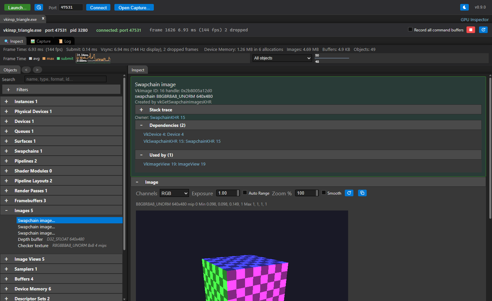

# Getting started

[Docs index](README.md) › Getting started

This is the shortest path from starting the app to a saved capture. The details of each step are
in the pages it links to.

## 1. Start GPU Inspector

An installed build starts from the Start menu, the application list or Applications. A source
build starts with `npm start` in `app/`.

The bar along the top is where sessions begin:

| Control | What it does |
|---|---|
| **Launch...** | Opens the launch dialog: pick an application and start it with the inspector |
| **Recent** | Relaunches a previous configuration |
| **Port** + **Connect** | Connects to an application that is already running with the capture library enabled |
| **Open Capture...** | Opens a saved `.gpucap` file. Dropping a file on the window does the same |

## 2. Launch an application

Press **Launch...**, choose the executable, and press **Launch**. The inspector starts the
application with the capture library enabled for that process only — nothing is registered
system-wide, and the application does not have to be modified.

What you pick depends on the platform:

- **Windows and Linux:** a Vulkan executable. See [Vulkan](VULKAN.md).
- **macOS:** a Metal application, usually an `.app` bundle. See [Metal](METAL.md) — code signing
  decides whether a given application can be inspected.
- **An Android phone or headset:** choose **Android device (adb)** under *Run On*. See
  [Android and Quest](ANDROID.md).

Each session opens as its own tab, with three tabs inside it:

| Tab | What it is for |
|---|---|
| **Inspect** | The objects the application has created right now |
| **Capture** | Capturing frames, and everything captured so far |
| **Log** | The capture library's own output, when **Layer log** was ticked |

## 3. Look at the live application

The **Inspect** tab lists every object the application created, as it creates them: images,
buffers, pipelines, shaders and the rest, each with the arguments it was created with. Click a
texture to read its current pixels back from the running application.

See [Inspect](INSPECT.md).

## 4. Capture a frame

Go to the **Capture** tab and press **Capture**. The next frame is recorded and opens in its own
tab: every command, grouped by submit, command buffer and render pass.

Click a draw to see the pipeline state and shaders it used, what each descriptor set bound, its
vertex and index data, and the render targets the pass produced.

See [Capture](CAPTURE.md).

## 5. Ask what the frame is doing

The **Reports** menu in a capture answers the whole-frame questions: where the time went, what
limits each pass, which passes feed which, how many times each pixel was shaded.

See [Reports](REPORTS.md), and [Finding GPU bottlenecks](PROFILING.md) for a method that uses
them in order.

## 6. Save it

The save button in the capture bar writes the capture to a `.gpucap` file. The file contains
everything the capture tab shows, so it reopens later on any machine, without the application —
for a bug report, for comparing against a later capture, or for
[Claude to read](MCP.md).

---

Previous: [Install](INSTALL.md) · [Docs index](README.md) · Next: [Vulkan](VULKAN.md)
