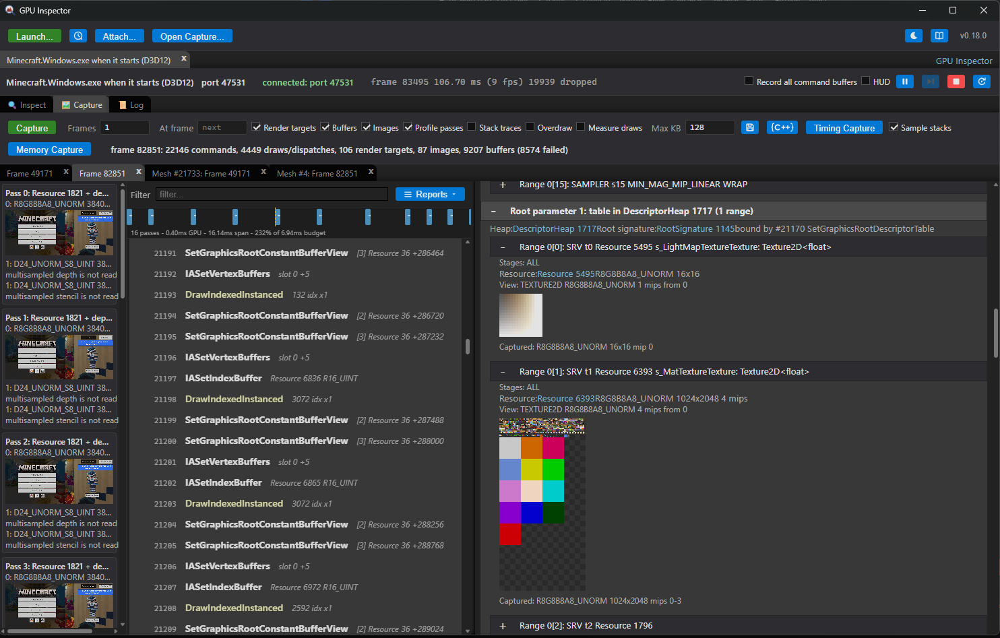

# How to inspect Minecraft Bedrock

Minecraft for Windows — Bedrock Edition, the one installed by the Xbox app or the Microsoft Store —
renders with Direct3D 12 and can be inspected and captured like any other Direct3D 12 application.
It takes one thing that is not obvious: it cannot be launched by the inspector, so the inspector
waits for it instead.

This is Windows only. Minecraft **Java** Edition renders with OpenGL, which GPU Inspector does not
capture at all; nothing here applies to it.



## Steps

1. Make sure Minecraft is **not** already running. The capture library has to be inside the process
   before it creates its Direct3D 12 device, and a game that is already running is past that.
2. In the inspector, press **Launch...**.
3. Set **Run On** to *An application started elsewhere (Direct3D 12)*.
4. Put `Minecraft.Windows.exe` in **Executable Name** — the name on its own, not a path.
5. Press **Wait**. The button says Wait rather than Launch for this target. A session tab opens and
   sits waiting, and its **Log** says `waiting for Minecraft.Windows.exe`.
6. **Now** start Minecraft, from the Start menu or the Xbox app. The order matters: the wait has to
   be running first.
7. The session connects when the game creates its device, a few seconds after the window appears.
   Capture from the **Capture** tab as usual.

From a shell, steps 2 to 5 are:

```
"GPU Inspector.exe" --wait-for-d3d12=Minecraft.Windows.exe
```

(from a source build, `npm start -- --wait-for-d3d12=Minecraft.Windows.exe`)

and the game itself can be started with:

```
explorer.exe shell:AppsFolder\Microsoft.MinecraftUWP_8wekyb3d8bbwe!Game
```

That is `!Game`, not `!App`. `!App` is not one of this package's applications and silently does
nothing.

## Why it has to be this way

**Do not** point **This computer** at
`C:\XboxGames\Minecraft for Windows\Content\Minecraft.Windows.exe`. Running that executable does not
run the game: it asks Windows to activate the package and exits within a second or two. The game
that appears afterwards is a different process, running from
`C:\Program Files\WindowsApps\Microsoft.MinecraftUWP_<version>_x64__8wekyb3d8bbwe\`, and Windows
started it on that request rather than as a child of it — its parent is the app model's activation
host, which is usually gone by the time anything looks. A launch therefore captures a process that
does no rendering and then exits.

For the same reason **Capture child processes** does not help here, and neither does the equivalent
in other debuggers: following works by descent, and the game descends from nothing you started.
Waiting works because it matches on the image name and does not care whose child the process is.

Nothing else is in the way, which is worth knowing because it is the sort of thing that gets
blamed. Minecraft declares `runFullTrust`, so it is a full-trust packaged application rather than a
sandboxed one: it reads the capture library from wherever it is installed or built, and needs no
file permissions granted to `ALL APPLICATION PACKAGES`. Its process mitigations do not block an
unsigned library either — `MicrosoftSignedOnly` and `BlockDynamicCode` are both off.

## If it does not work

Read the session's **Log** first. `injected ... into pid N` means the library is in, and what
follows is an ordinary Direct3D 12 session. **Attach...** on the main bar is the other way to tell:
a game with the library in it is listed there as `Minecraft.Windows.exe (D3D12)` whether or not the
waiting session has connected yet.

| What the log says | What it means |
|---|---|
| `no Minecraft.Windows.exe started within ...` | The game never started, or it started before the wait did. Close it fully and try again. |
| `injection failed: ...` | The library did not get in. Close the game fully and try again; see below. |
| `no D3D12 device was created in Minecraft.Windows.exe within ...` | The library went in too late — the game already had its device. Start the wait before the game. |

Minecraft is not yet a reliable target, and it is not all our doing. Two things were seen while
working this out, neither of them understood:

- The game sometimes exits during the injection, with `STATUS_PARTIAL_COPY` (0x8000000D). The watch
  freezes a process the moment it appears and holds it for something over a hundred milliseconds,
  and a packaged application is under the app model's process lifetime management from its first
  instruction, so that is the first thing to suspect.
- After a number of launches in quick succession — including launches with nothing of ours running
  at all — the game becomes unwilling to start, producing no process for minutes at a time. It
  recovers on its own after a pause, and a reboot settles it.

So: if a capture does not come off, close the game completely, wait a moment, and start again. It
does work.

## What a frame looks like

The capture at the top of this page is a frame of a loaded world: some 22,000 commands and 4,400
draws and dispatches over 16 render passes, against a hundred-odd render targets and several
thousand buffers. Most of it is one pattern repeated — a root constant buffer view, vertex and
index buffers, and a `DrawIndexedInstanced` of a few thousand indices, which is a chunk of terrain
drawn once. A title-screen frame is a much smaller animal: a few hundred commands over a couple of
dozen passes.

The usual reports all apply — see [Capture](CAPTURE.md) for reading the command list and
[Reports](REPORTS.md) for what can be run over a frame.

## See also

- [Direct3D 12](D3D12.md) — the backend this uses, including the rest of what waiting for an
  application can do
- [The launch window](LAUNCH.md) — every field of the window, including **Capture child processes**
  for the games that *are* started by their own launcher
- [Troubleshooting](TROUBLESHOOTING.md)
