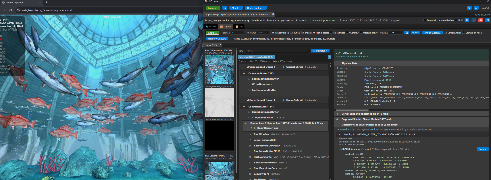

# How to inspect a WebGL page

[Docs index](README.md) › WebGL pages

A browser doesn't hand WebGL straight to the GPU. It runs every WebGL call through
[ANGLE](https://chromium.googlesource.com/angle/angle), which turns OpenGL ES into whatever the
machine has: Direct3D 11 on Windows by default, or Vulkan, Metal or desktop OpenGL. So capturing a
WebGL page means choosing *which layer of that translation to capture*, and the two browsers offer
different layers:

| Browser | What a capture holds | Captured by | Replay |
|---|---|---|---|
| **Chrome, Edge** (and other Chromium browsers) | ANGLE's **Vulkan**: the render passes, pipelines and descriptor sets it built from the page's WebGL | the Vulkan layer | yes, with everything a Vulkan capture has |
| **Firefox** | The page's **OpenGL ES calls**, just as they went into ANGLE, which is nearly the WebGL itself | the [OpenGL ES plugin](GLES.md) | no |

Pick Chromium to measure, replay or edit a frame. Pick Firefox to see the calls the page made.



## Steps

1. Press **Launch...** and set *Run On* to **A web page in a browser (WebGPU, WebGL)**.
2. Pick a **Browser**.
3. Put the page in **Page URL**.
4. Set **Page API** to **WebGL**.
5. Press **Launch**, and capture from the **Capture** tab once the page is drawing.

From a shell:

```
GPUInspector.exe --launch-browser=https://webglsamples.org/aquarium/aquarium.html --browser=Chrome --api=webgl
```

**Page API** controls what the launch changes:

- **Chromium** is started with `--use-angle=vulkan`, so ANGLE draws with Vulkan. The Vulkan layer is
  already enabled in the browser's GPU process, and it connects when ANGLE creates its device.
  Without the switch, ANGLE runs on Direct3D 11, and nothing the inspector captures there is the
  page's work.
- **Firefox** gets the OpenGL ES plugin instead of the Direct3D 12 library. Firefox ships ANGLE as
  its own `libGLESv2.dll`, and the plugin hooks it, so its command line needs no changes.

## Chrome: what ANGLE made of the page

A Chrome capture is an ordinary [Vulkan](VULKAN.md) capture of ANGLE, so each WebGL draw is a
`vkCmdDrawIndexed` or `vkCmdDraw` inside a render pass. Some things are worth recognizing:

- **Frames end at a present.** With ANGLE on Vulkan, Chrome composites through a Vulkan swapchain
  too, so the capture has real frame boundaries. The capture bar shows the frame rate and any
  dropped frames as it would for a game.
- **The compositor is in the capture too.** Some of the render passes are the page's
  canvas (a 1024×1024 target for the aquarium). Others draw the browser window's swapchain image.
  The render targets show which pass is which.
- **Uniforms live in a dynamic uniform buffer.** ANGLE packs each draw's default-block uniforms
  into one buffer and binds it with a new dynamic offset per draw. That is why the frame has about
  two `vkCmdBindDescriptorSets` per draw. Select a draw, and its **Descriptor Set 0** section decodes
  the uniform block at that offset: the page's matrices appear as `mat4` members.
- **Most of the pipeline state is dynamic.** ANGLE sets the vertex input, cull mode, depth test and
  stencil state as commands (`vkCmdSetVertexInputEXT`, `vkCmdSetCullModeEXT` and so on). It builds
  its pipelines from graphics pipeline libraries, and the pipeline a draw shows is
  [put together from its parts](INSPECT.md).
- **Shaders are ANGLE's SPIR-V.** A WebGL shader's GLSL has been translated, so the stage is
  `main` and the page's own variable names are gone. The disassembly and reflection are what ran.

Because it is a Vulkan capture, everything under [Capture replay](REPLAY.md) applies: overdraw,
pixel history, per-draw measurements, shader editing and Export to C++. The aquarium frame
**replays identical**: every render target, including the swapchain images.

## Firefox: the page's own calls

A Firefox capture is an [OpenGL ES](GLES.md) capture. WebGL is OpenGL ES with a few restrictions,
so the calls are nearly one-for-one what the page's JavaScript made: `glBindBuffer`,
`glUniformMatrix4fv`, `glDrawElements`. Select a draw to see its program, vertex input, textures,
uniform values and blend and depth state, as for any OpenGL ES application.

- **Two contexts.** One is the page's WebGL. The other is Firefox's WebRender compositor, which
  also runs on ANGLE. Its shaders read attributes like `aDeviceRect` and `aUvRect0`. The command
  tree groups the calls by context.
- **Frames end at `glFlush`.** A browser's WebGL never calls `eglSwapBuffers`, because the
  compositor presents what the page drew. After 60 flushes without a swap, the plugin starts ending
  frames at `glFlush` and `glFinish`, but only at a flush that follows drawing. The **Log** says
  `60 flushes without a swap: frames end at glFlush and glFinish`, and the capture bar says so too.
  One frame then holds one page frame: the aquarium's 613 draws, plus the compositor's work.
- **Shader source is Firefox's translation.** Firefox validates and rewrites every WebGL shader
  before ANGLE sees it, so identifiers show up as `webgl_<hash>`. The structure is the page's.

The OpenGL ES plugin has no replay, and [what is not there yet](GLES.md#what-is-not-there-yet)
applies. That means no overdraw, pixel history or shader editing, and no depth read-back. Frame
Stats, pass timings, the render graph and the Tile-Based GPUs report all work.

## One level up

For the page-level question, *which WebGL call did this and from which line of JavaScript*,
[Spector.js](https://spector.babylonjs.com/) records a frame of WebGL calls in the page itself. It
does for WebGL what [WebGPU Inspector](https://github.com/brendan-duncan/webgpu_inspector) does for
WebGPU. Use it to find the call, and use this tool to see what the GPU was given for it.

## If it does not work

Read the session's **Log** first.

| What you see | What it means |
|---|---|
| A Chrome session stays on *connecting*, or its capture has none of the page's draws | ANGLE did not run on Vulkan. Check that **Page API** is WebGL: without it ANGLE runs on Direct3D 11, which is not captured. A page that prints `gl.getParameter(gl.getExtension('WEBGL_debug_renderer_info').UNMASKED_RENDERER_WEBGL)` shows `Vulkan` when ANGLE runs on Vulkan and `Direct3D11` when it does not. |
| Firefox's Log shows `capture armed` and nothing after | The page has stopped drawing, or the plugin is still waiting on swaps: it only switches to flushes after 60 of them. Frames only end while the page draws, so for a page that redraws only when something changes, interact with it after pressing **Capture**. |
| Firefox's Log never shows `glesinsp: context` | The page has not created a WebGL context yet, or Firefox fell back to software WebGL. `about:support` lists the WebGL renderer. |

## See also

- [Web pages and WebGPU](BROWSER.md): the browser launch in full, including the profile it
  uses and doing it by hand
- [A WebGPU page](HOWTO_BROWSER.md): the same launch for a WebGPU page
- [OpenGL ES](GLES.md): what an OpenGL ES capture shows, and what it does not yet
- [Vulkan](VULKAN.md) and [Capture replay](REPLAY.md): what a Chrome capture can do
