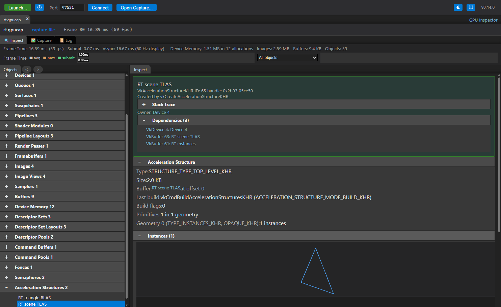

# Inspect

[Docs index](README.md) › Inspect

The **Inspect** tab is the live view of the application: every object it has created, as it
creates them, each with the arguments it was created with. Nothing has to be captured first.

## Finding an object

Objects are listed by type — images, buffers, pipelines, shader modules, descriptor sets, device
memory and the rest — with a count beside each type. On Metal the types are `MTLTexture`,
`MTLBuffer`, `MTLLibrary` and so on instead. Direct3D 12 has one type for every resource, so its
textures and its buffers are listed as two groups of their own rather than as one: a frame's render
targets would otherwise sit among its vertex, index and constant buffers.

- **Search** matches a name, label, type, format or id.
- **Filters** narrow further: images by format, size, layers and usage; buffers by size and
  usage; shaders and pipelines by stage; descriptor sets by what they bind. These read the Vulkan
  descriptions, so they narrow a Vulkan session; a D3D12 session is narrowed by search.
- **Only objects used in the last capture** hides everything the captured frame did not touch,
  which is usually the fastest way to a short list.
- The back and forward buttons walk through the objects you have visited.

## Reading an object

Selecting an object shows:

- **Arguments** — the full creation call, with every struct member and `pNext` chain decoded.
- **Dependencies** — what it was made from and what uses it, each a link. An image view links to
  its image, a pipeline to its layout, shaders and render pass.
- **Memory** — for images, buffers and device memory: the allocation it is bound to, the offset
  and the heap.
- **Stack trace** — where the application created it, when **Stack traces** was ticked in the
  launch dialog. Symbols come from the application's debug information; on Android, from the
  directories given as **Symbol directories**.

Destroyed objects are marked as such rather than disappearing, so a dangling reference still says
what it pointed at.

## Textures

Selecting an image opens an **Image** view that reads the current pixels back from the running
application. The toolbar has the mip level and array layer, zoom, **Smooth** (filter the image
instead of showing its texels), a refresh button to read it again, and a button that copies what
is shown as a PNG. The value of the texel under the pointer is shown as you move it.

## Descriptor sets

A descriptor set shows its layout and, under **Contents**, what is bound to each binding right
now — **Refresh** reads it again from the application. Bindings that were never written say so.
Buffers are decoded with the types the shader declares, so a uniform block reads as its fields
rather than as bytes.

## Acceleration structures

A ray tracing acceleration structure is opaque: the driver owns its layout and nothing reads one
back. So the view of one is what it was *built from*, which the capture library records as the build
goes by. Vulkan and Direct3D 12 are both covered and read the same in the panel, with one difference
worth knowing: a `VkAccelerationStructureKHR` is a handle the application created, while a DXR
structure is a range inside a UAV buffer with no object of its own, so the capture library mints one
per address a build writes to. Those appear under **Raytracing Acceleration Structures** and carry
the address instead of a handle.

**Acceleration Structure** is that build — its type and mode, and each geometry with its primitive
count, and for triangles the vertex format, stride and index type. A build names the memory it reads
by device address rather than by handle, so the layer resolves those addresses back to the buffers
holding them and the section names the buffer and the offset into it. A structure that was filled
before the inspector attached says **Not built while the inspector was watching**, which is the
usual state of a bottom level: most applications build theirs once, at load.

**Instances** on a top level lists what it was built out of: for each instance the bottom level it
names, where its transform puts it, its visibility mask, and its custom index, hit group offset and
flags where they are not the default. An instance refers to its bottom level by device address, not
by handle, which is why the layer records the address of every structure the application asks for
one of — that map is what turns the reference back into an object you can click. A
`D3D12_RAYTRACING_INSTANCE_DESC` is byte for byte a `VkAccelerationStructureInstanceKHR`, down to
the flag bits, so the two read identically here.



The instances are also drawn, in the same preview the [mesh view](REPORTS.md#mesh-view) uses. An
instance whose bottom level's geometry is in the capture is drawn with that geometry, placed by its
transform; one whose is not is drawn as a box where it sits. A scene of boxes is the common case and
is not a fault — it means those bottom levels were built before anything was capturing. Capturing a
frame of an application that rebuilds its geometry each frame, or that streams it in, fills them in.

## Shader binding tables

A trace does not name the shaders it runs. It names regions of memory, and each record in them
begins with an opaque handle the driver gave for one of the pipeline's shader groups — so a table
read on its own is bytes. The capture library keeps both halves: the handles the driver handed out
(`vkGetRayTracingShaderGroupHandlesKHR`, or DXR's
`ID3D12StateObjectProperties::GetShaderIdentifier`) and the regions' contents, read back from the
addresses the trace pointed at. Selecting the trace shows each region's record count and stride, and
then what every record actually runs.

A record whose handle matches nothing is the case worth having this for: those rays run the wrong
shader or none, and nothing else in a capture would show it. It happens when a table was filled from
another pipeline, or from handles fetched before the pipeline was rebuilt.

On Direct3D 12 a record resolves to an **export name** rather than to a group index, because the
runtime hands identifiers out per name. Selecting the state object lists its hit groups with the
shaders each names, then every other export the runtime gave an identifier for, with the recursion
depth, payload and attribute sizes above them. A DXIL library the description exported wholesale
(`NumExports` 0) can hold exports the capture never saw an identifier for, and the panel says so
rather than letting a short list read as a complete one.

## Shaders

A shader module or pipeline has a **Shader Code** section per stage with these views:

| View | What it is |
|---|---|
| **Source** | The original source the compiler embedded in the SPIR-V. Shown only when the shader carries it — see [shader sources](VULKAN.md#shader-sources) |
| **SPIR-V** | Disassembly, from `spirv-dis` |
| **GLSL**, **HLSL** | Decompiled by `spirv-cross` |
| **Reflection** | Entry points, inputs and outputs, resources and push constants, read from the SPIR-V itself |

On Metal, a library shows the Metal Shading Language it was compiled from, when it was compiled on
the spot rather than loaded as a precompiled `metallib`. On Direct3D 12, a pipeline state's stages
show their DXBC or DXIL disassembly, their HLSL as the Source view — what `dxc -Zi` embedded in
the container, or what `dxc -Zs` wrote to a PDB beside the build, found under the session's
**Symbol directories** — and a Reflection section from the bytecode (DXIL needs `dxcompiler.dll`;
see [Direct3D 12](D3D12.md)).

### Editing a shader

**Edit** opens the shown text in an editor. **Compile & Apply** compiles it with the Vulkan SDK's
compilers on this machine and swaps it into the running application — the next frame it draws uses
your version. **Restore Original** binds the application's own pipeline again. An edited stage is
marked `[edited]` in its heading.

GLSL, HLSL and SPIR-V assembly can all be edited; which compiler is needed depends on which one
you edit (`glslangValidator`, `dxc`, `spirv-as`). A shader with embedded source is edited as that
source. `#include` directives in GLSL and HLSL are resolved against the directories in
**Source roots** ([shader sources](VULKAN.md#shader-sources)), so a shader split across files
compiles as it did in your build.

This works for Vulkan on the desktop and on [Android](ANDROID.md), where the shader is compiled
here and sent to the device, and for [Direct3D 12](D3D12.md), where the HLSL is compiled with
`dxc` for the stage's profile and the library rebuilds the pipeline state with it. It does not
apply to [Metal](METAL.md).

**Compile & Replay** runs the edit somewhere else: in the capture that is open, replayed on this
machine's GPU with your version of the stage ([Capture replay](REPLAY.md#a-shader-edited-in-the-capture)).
The application is not touched, and does not have to be there — this is how a shader is edited
in a capture *file*, where there is no next frame to look at. Because every render target of the
captured frame was read back, the answer is exact. A **Shader Edit** tab opens beside the capture
with each target the edit changed: as captured, with the edit, and the texels that differ picked
out, with how many there are. Targets that came out identical are counted, which is an answer too
— nothing the frame shows depends on the change. If the driver refuses the edited stage (its
inputs no longer match the stage before it, its bindings the layout), the tab says that first:
the pipeline is then left out of the replay, and the targets differ by its draws being missing
rather than by what the edit computes. Vulkan and Direct3D 12.

A pipeline linked from graphics pipeline libraries shows and edits the stages its libraries hold.
An application drawing with shader objects (`VK_EXT_shader_object`) edits a **VkShaderEXT** the
same way, unless it was created from a binary. A shader object created linked to others is
replaced along with its whole set, each made again unlinked.

## Compiler statistics

Launch with **Compiler statistics** and every pipeline carries what the driver's shader compiler
made of each of its stages, shown on the pipeline in the Inspect tab:

```
VS  vertex · subgroup 32
    Register Count   16
    Binary Size      1024
    Input Count      8
```

Registers are the number to watch. A stage using many of them limits how many threads the GPU can
keep in flight, which is what the hardware counters see as low occupancy
([Finding GPU bottlenecks](PROFILING.md)). Spilled or local memory means the compiler ran out of
registers and pushed values to memory, which is slower still.

What the statistics are called is the driver's choice, not Vulkan's: the extension defines the
mechanism and each driver decides what to report, so they appear exactly as the driver names them. A
driver that reports none leaves the section out. It needs `VK_KHR_pipeline_executable_properties`,
and it is off by default because the driver has to keep the information, which costs compile time
and memory in the target.

## Validation messages

With **Validation layer** ticked at launch, the errors and warnings it reports are listed in a
**Validation Messages** section, each linked to the objects it names. With **Sync validation**,
synchronization hazards appear the same way, linked to the command that caused them.

**GPU validation** adds the class neither of those can reach. The validation layer works from the
calls it sees, and an index computed inside a shader is not one of them: a draw that reads element
900 of a 256-entry descriptor array, or dereferences a buffer address the application never
allocated, is a correct-looking call. GPU-assisted validation rewrites the shaders to check those on
the device and report what they found, so the message names the dispatch and the binding it went out
of bounds on. It is much slower than the rest — the shaders are patched and every access is checked
— so it is worth turning on to answer a question rather than leaving on. On D3D12 the same tick
enables the debug layer's GPU-based validation.

A GPU-assisted message is about a shader invocation, so it arrives when the submission finishes,
after the capture that holds the command is over. The layer keeps what the capture recorded for
exactly this reason and reads the command out of the message — the command buffer it names, the
entry point in its header, and which draw or dispatch of that buffer it was — so the message is
attached to the dispatch it happened in, marked in the command list like any other. The same
mistake is reported once per invocation that made it, hundreds a frame; those are folded into one
message with a count, keeping apart what tells two mistakes apart (the descriptor, the shader
instruction, and which draw or dispatch it was).

On Metal this is Metal's own API and shader validation, in the mode that logs a failure instead of
aborting.

## Leaks

**Leaked Objects** lists objects that were created and never destroyed, each with the creation
arguments last known for it and, when they were recorded, its stack trace.

## Frame time

The **Frame Time** graph plots the application's recent frames: the average, the maximum, and the
CPU time spent inside `vkQueueSubmit`. It is the quickest check of whether a change you made in
the application or in a shader actually moved anything.

## The in-app HUD

**HUD** in the session bar draws the frame time over the application's own window, so it can be
read without looking away from what the application is doing -- and so it is in any screenshot or
video of it:

```
GPU INSPECTOR - VULKAN
6.95 MS  143.9 FPS
MIN 6.29  MAX 7.43  VSYNC 144 HZ
```

The figures are the application's whole frame, present included, averaged over half a second, with
the shortest and longest frame of that window beside them. The frame time here is the interval
between presents, which is not the same number as the CPU time the **Frame Time** graph plots: an
application waiting for vblank spends most of its frame blocked inside the present call, and only
this line counts that.

The HUD is drawn by the capture library into the frame the application is about to show, so it
costs one small extra draw a frame and nothing else. It works on all three backends. Two cases
where it does not appear, both logged once:

- a swap chain the application did not create as a render target (some engines blit into one);
- on Metal, an application that presents its drawables itself from a completion handler rather
  than through `presentDrawable:` -- by then the command buffer that drew the frame has finished,
  and there is nothing left to draw into. Live pause still works there.

`VKINSP_HUD=1` (or `DXINSP_HUD=1`, `MTLINSP_HUD=1`) turns it on from the start, before any UI is
attached.

## Live pause

The pause button beside the HUD checkbox holds the application at its next frame boundary, on the
frame it has just drawn. The window keeps showing that frame, and with the HUD on it says which:

```
PAUSED AT FRAME 4564
```

The step button then lets exactly one more frame through and pauses again, which is how a frame is
advanced one at a time. Resume lets it go.

While paused, everything the Inspect panel shows is a snapshot of a still application, so an object
list or a descriptor set cannot change under you as you read it.

Two things to know:

- **A capture resumes the application.** A capture is recorded from frames the application renders,
  and a paused one renders none, so asking for a capture while paused resumes rather than hanging.
  The pause button follows on its own when that happens.
- **The window will say it is not responding.** Pausing stops the application's render thread
  inside its present call, so it stops pumping window messages too, and after a few seconds the
  system marks the window that way and draws its ghost copy. The frame is still what is on screen.
  This is inherent to freezing a running application.

---

Previous: [Android and Quest](ANDROID.md) · [Docs index](README.md) · Next: [Capture](CAPTURE.md)
