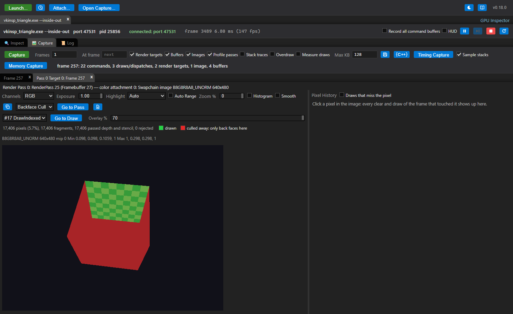
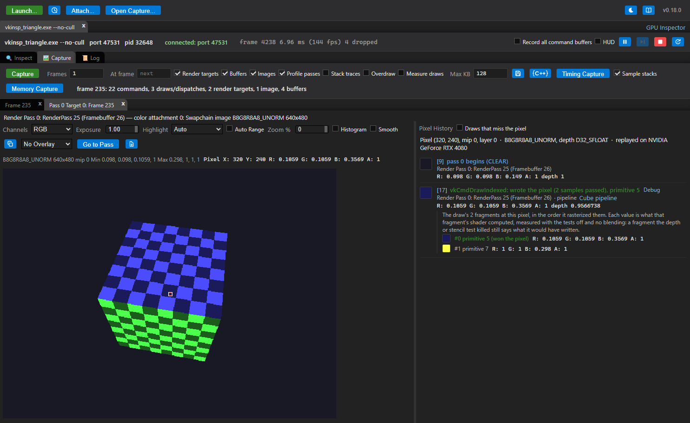

# Reports

[Docs index](README.md) › Reports

The **Reports** menu in a capture answers questions about the whole frame instead of one command.
Every report links back into the command list, so a number you want to understand is one click
from the draw that produced it.

Each report opens in a tab beside the capture's own, so a report and the command details stay on
screen together and two reports can be open at once. The menu marks the reports that already have
a tab. Every report's tab carries two controls, and its handle's context menu the same two:

- **Open in New Window** puts a copy of the capture in a window of its own, opened on that report —
  a live report, not a picture of one, so it still links back into its own command list. Use it to
  put two captures' reports side by side.
- **Export to HTML** writes the report to a standalone HTML file: what is on screen, with the
  application's styles in it, readable in any browser and with nothing else needed. The file is a
  snapshot — sections are written out open, controls are inert, and nothing in it measures anything
  again. It is what to attach to a bug or a review.

Some answers are about one render target or one draw rather than the whole frame. They open in
tabs beside the capture's own: the [render target tab](#the-render-target-tab) (overdraw, draw
overlays and pixel history), the [mesh view](#mesh-view) and the [shader debugger](#shader-debugger).
The render target tab exports to HTML the same way.

For the order to use them in when a frame is slow, see
[Finding GPU bottlenecks](PROFILING.md).

## Frame Stats

In order down the view:

- **Frame Bound** — the frame's GPU time next to the CPU submit time and the frame interval, with
  a verdict on which of them the frame is waiting for. This is the first thing to read: it says
  whether the GPU is the problem at all. One verdict is not a bottleneck: when the captured passes
  span *longer than the frame the application reaches without a capture*, the card reports the
  capture's own cost instead of naming a limiter. Capturing puts a timestamp, statistics and
  occlusion query around every pass and reads every render target back, so the captured frame is
  the more expensive one — and a frame cannot be shorter than the GPU work it waits for, so the two
  bars are not on the same footing and no honest verdict can be drawn from them. Take the GPU
  figures from it as relative costs between passes, not as the frame's budget.
- **Where the CPU went** — the frame's CPU time split into submitting, waiting for the GPU,
  waiting for the display, creating pipelines, and the application's own work. A pipeline built
  inside a frame stops it, so that row appearing at all is worth reading first; see
  [is the GPU even the problem](PROFILING.md#step-1-is-the-gpu-even-the-problem).
- **Timeline** — the threads and the GPU drawn as tracks on one axis, which is the only view here
  that can show the GPU *idle*. Zoomable and pannable, and a pass's span selects it in the command
  list. See [when, not how much](PROFILING.md#step-1b-when-not-how-much).
- **Pass Timings** — each pass's GPU time, with the total and the span they cover.
- **Frame Statistics** — counts for the frame: commands by kind, draws (indexed, indirect, mesh),
  dispatches, submits and command buffers, passes and attachments, pipelines and stages bound,
  descriptor sets and what they bound, memory traffic and geometry.

**Frame Issues** lists what the frame analysis flagged — tiny draws, redundant binds, passes
without multiview on an XR frame, and the rest — each linked to the command it is about.
Severity checkboxes and a checkbox per rule narrow the list. The same findings appear inline on
the commands they concern.

## Analyze Shaders

Static analysis of every shader the frame's draws and dispatches used, worst first. It reads the
SPIR-V directly, so no shader source is needed.

For each shader: an estimated cost broken into ALU, special functions, texture and memory
operations, weighted by loop nesting; the costliest source lines when the shader carries debug
information; and findings for the patterns that usually matter — texture samples and atomics in
loops, expensive built-ins, non-constant and integer division, derivatives inside branches,
discards, loop-invariant work that could be hoisted.

## Shader Flame Graph

The frame's GPU work as a flame graph: pass, then pipeline, then shader stage, then function, then
source line. The pass level is measured time (from **Profile passes**); inside a pass the cost
model splits it across the draws and the functions they ran. It also lists the hottest functions
and lines of the frame. Clicking a frame zooms in; a draw frame selects the draw, and a shader
frame opens the shader.

Two zooms, which combine: clicking a frame makes it the whole width and leaves a breadcrumb to
walk back out, and **Ctrl+Wheel** zooms continuously about the pointer, with dragging to pan. Use
the wheel for the frames a pass is too small to show — the graph says how many it left out — and
the breadcrumb or **Reset zoom** to get back. The breadcrumb shows how far the wheel has zoomed in,
and clicking that shows the whole of the frame in focus again.

Inside a pass, the split between draws is modeled until something measures it:

- **Profile passes** counters, where the capture has them, give each pass's fragment shader
  invocations, and the fragment stages are weighted by those instead of by scissor area.
- **Measure draws** (Vulkan and Direct3D 12) replays the capture on this machine's GPU with a timer
  and a pipeline statistics query around every draw. A D3D12 capture taken with the capture bar's
  **Measure draws** already has them; this is for one that was not. Each draw then takes its share of the pass by its measured
  time, and each stage its measured invocation count. The measurements are saved with the capture.
  They also fill in the depth rejection figure for passes whose draws are recorded into secondary
  command buffers, which the capture itself cannot measure (see
  [Finding GPU bottlenecks](PROFILING.md)).
- **Measure shader** (Vulkan and Direct3D 12) measures what a stage's functions, source lines and
  textures cost. On D3D12 the variants are of the stage's DXIL
  ([how](D3D12.md#shader-cost-by-ablation)), and the stage needs its HLSL for the graph to have
  frames to size.
  It replays one draw of the stage with variants of its shader, each missing one part: a function's
  calls, a line's values, or every read of one texture. The time a variant saves is that part's
  cost. The button measures the stage of the selected frame, or the widest fragment or compute
  stage when nothing is selected. It works this way:
  - **Frames.** The stage's function and line frames are sized by their measured shares.
  - **List.** The graph lists every part with what it saved, textures included.
  - **Lines.** Taking a line out also takes out the work that only feeds it. A line's **own** time is
    therefore what it saved beyond the costliest measured part feeding it.
  - **Not measured.** Some parts are left out, and the list says why: values that decide a
    branch or a loop, a value a loop carries into its next iteration (removing it would let the
    compiler move the loop's work out), and lines of a module without line information.
  - **Precision.** Savings within the baseline's noise mean nothing.
  - **Saved.** The measurements are saved with the capture.

Use it to find which shader function is eating a pass, rather than which pass is eating the frame.

## GPU Bottlenecks

Every pass, measured in the terms a bottleneck is usually described in:

- GPU time
- how many times each pixel was shaded (overdraw)
- how large the triangles were (fragments per primitive)
- whether the depth test was rejecting work
- which stage the pass waits on

Each number is shown with what normally causes it. The counters come from a pipeline statistics
query on Vulkan and from Metal's counter sets on macOS; which of them are available depends on the
API and the GPU.

Once the hardware counters below have been read, the **Verdict** column shows what they measured
instead of what the rest of the report infers: the unit at its limit rather than a stage deduced
from overdraw and triangle size. On Vulkan this is usually the only verdict available at all, since
the vertex and fragment spans a stage verdict needs are Metal's.

**Hardware counters** at the foot of the report answer the question the rest of it can only infer:
which unit inside the shader core a pass actually saturates — shader throughput, memory bandwidth,
cache, occupancy, the ALU and FMA pipes. **Measure hardware counters** replays the capture on this
machine's GPU reading its own counters around each render pass, and the numbers appear as a column
per counter beside each pass's GPU time. The frame is replayed once per collection pass the counters
need, so it takes a while on a large capture, and the result is kept with the capture and saved into
its file.

It works on a **Vulkan** capture (`vkinsp_replay`) and on a **Direct3D 12** one (`dxinsp_replay`);
a Metal capture has no replay to read them with. Vulkan reads them through NVIDIA's Nsight Perf SDK
or `VK_KHR_performance_query`, whichever the device has; Direct3D 12 has no portable counter API, so
it is the Nsight Perf SDK and therefore NVIDIA only. Either way the machine has to allow GPU
performance-counter access — on Windows that is the NVIDIA Control Panel's *Developer > Manage GPU
Performance Counters*, set to allow all users, or a replay run as administrator. Without it Vulkan
says `ERR_NVGPUCTRPERM` and Direct3D 12 reports that the profiled submission never finished, which
is what the refusal looks like from there. [Capture replay](REPLAY.md#hardware-counters) has the
detail.

[Finding GPU bottlenecks](PROFILING.md) is the walkthrough, including the thresholds each number
is judged against.

## Render Graph

The same frame as a dependency graph: every pass, the resources it reads and writes, and which
pass produced each of those. It is drawn as a resource lifetime chart, with the selected pass's
producers and consumers beside it.

It answers:

- why a pass is there at all, and what would break if it went
- what the frame reads from before the capture began
- which passes write something that nothing ever reads
- the frame's critical path

## Tile-Based GPUs

What the frame would cost a tile-based GPU (the mobile ones: Arm Mali, Qualcomm Adreno, Apple,
Imagination PowerVR). Such a GPU renders each render pass one screen tile at a time in on-chip
memory, so beyond its shading a pass pays for what crosses between that tile memory and DRAM:
attachments loaded when it starts, stored when it ends, and whatever its shaders read and write in
memory meanwhile. A desktop GPU pays little for any of that, so a frame that runs well on one can
be bandwidth bound on the other, and this report says where. It works on Vulkan, Direct3D 12 and
Metal captures alike, from the render graph.

- **Attachment traffic.** Per render pass, the bytes each attachment loads (its contents are kept
  rather than cleared or discarded) and stores (rather than thrown away), at the attachment's own
  size, summed over the frame and quoted at 60 frames a second. An estimate: a GPU that compresses
  its framebuffers moves less. A Direct3D 12 pass begun with `OMSetRenderTargets` has no load or
  store actions, so it counts both; the parts of a render pass suspended across command lists
  count only where the pass begins and ends.
- **Avoidable.** The part the frame's own structure does not need, only where that is certain: a
  target stored and loaded straight back by the next pass, a store replaced before anything reads
  it, depth nothing reads, and a result the next pass reads once per pixel (a subpass, framebuffer
  fetch or a transient target would keep it on chip). A color result nothing in the capture reads
  is shown apart: it is usually the frame's output on its way to something the capture does not
  see (an XR compositor, the next frame).
- **Post-processing.** Render passes that sample what an earlier pass rendered at their own size,
  and whether they read each pixel once at its own position (it could stay in tile memory) or
  filter it — a blur, a downsample — which needs it in memory. Vulkan captures say which, from the
  fragment shaders' SPIR-V; on the other APIs it is left open.
- **Out of the tile.** Shader writes from inside a render pass (storage, UAV), a pass sampling the
  target it renders to, a compute pass between two render passes that reads what the first
  rendered, and copies or clears of render targets outside a pass.
- **Subpasses** (Vulkan): which render passes have more than one, and their input attachments.
- The Frame Issues about tile memory — `color-load`, `depth-store`, `msaa-store`,
  `mergeable-passes`, `subpass-candidate`, `transient-candidate` and the rest — listed beside it,
  and each API's own spelling of the fixes.

`analyze_tiling` gives the same over [MCP](MCP.md).

## Validate

The frame replayed on this machine's GPU under the Khronos validation layer, whether or not the
application was launched with it. A live session only has validation messages when **Validation
layer** was ticked at launch; a capture file arrives from a tester, an agent or another machine,
and the question about it is whether the frame in it is legal. Replaying the file needs neither
the application nor the machine it ran on.

The report is the layer's errors and warnings, worst and most frequent first, grouped by VUID with
the message the layer gave. Each fired on a captured command, which its row opens in the command
list, and the command carries the same mark there as a live message would. The replay knows
which command it is re-issuing when a message fires, so the link is exact, where a live session
has to match the message's text back to a command. A message fired while the capture's objects
were being created, or at submission, says so instead of naming a command.

**Validate again with synchronization validation** runs it once more with the layer's hazard
detection on: a write with no barrier before the read. It is slower, and it can miss a hazard the
application has, because the replay's own read-back barriers order some of the work it did not.

Vulkan captures only; a Metal or Direct3D 12 capture carries the messages it was taken with.
Needs the Vulkan SDK's validation layer on this machine, and says so when it is missing. The MCP
server's `get_validation` does the same with `replay: true`.

## The render target tab

**Open in Tab** under any of a pass's render targets (in a draw's details, or the pass's) shows the
target in a tab of its own: the image at any zoom on the left, and the history of whichever pixel
you click on the right. The **overlay list** in its toolbar draws over the image: **Overdraw**,
**Highlight Draw**, **Depth Test** or **Wireframe**. **Reports → Overdraw** opens it on the frame's
first measured pass with the overdraw on.

### What the picture cannot show

A NaN in a render target is invisible: it clamps to some ordinary color on screen, and nothing else
in a capture points at it. So **Highlight** marks the texels a picture cannot show, and is on
(*Auto*) to begin with — an image that has them is already wrong, and you would have to suspect it
to go looking.

| Color | What it marks |
|---|---|
| Magenta | NaN |
| Cyan | `+Inf` |
| Orange | `-Inf` |
| Blue | Below 0, with *Auto + clipping* |
| Red | Above 1, with *Auto + clipping* |

Clipping is not on by default because a value outside `[0,1]` is ordinary in an HDR target rather
than a fault. The counts appear beside the format whenever there are any, and **Min** and **Max**
are over the finite values only — one infinity would otherwise be the whole range, and **Auto
Range** divides by it, which turns the image black and hides the very thing that is wrong with it.

**Histogram** draws each channel's distribution over its own range. It answers a different question
from the image: a target that looks black because a single texel is ten thousand, or a depth buffer
whose values are all crowded against the far plane, both look unremarkable until you see the shape.

These work on any read-back image, so on Metal and D3D12 captures too.

### Overdraw

How many fragments landed on each pixel, drawn over the pass's render target. Two numbers per
pass: fragments that passed the depth and stencil tests, and every rasterized fragment. Hovering
shows the counts under the pointer.

How it is measured depends on the API:

- **Vulkan** — pick **Overdraw** in the overlay list, or press **Measure Overdraw** in a pass's
  details. The capture is replayed on this machine's GPU, drawing each pass again with a counting
  shader. The application does not need to be running, but a GPU that can replay the capture does.
  See [Capture replay](REPLAY.md#overdraw).
- **Metal** — tick **Overdraw** in the capture bar before capturing. The measurement happens
  inside the captured frame.

On Vulkan, a draw whose fragment shader discards (or writes depth or the sample mask) is counted
with its own shader, edited to write the count, so alpha-tested geometry counts only where it is
drawn; a shader that writes memory is the exception, since drawing it again would repeat the writes,
and it counts every fragment it rasterized. Metal's counting shader does not discard, so there
alpha-tested geometry counts as opaque. A multiview pass (an XR frame's two eyes) is counted
in every view: the pass's figures are of the views together, its details show a heatmap per view, and
the render target tab shows the heatmap of the layer it shows.

### Draw-call overlays

Where one draw landed, over its pass's render target: pick **Highlight Draw**, **Depth Test** or
**Wireframe** from the render target tab's overlay list, or press **Highlight Draw** under a draw's
render targets. The draw list beside it (with **‹** and **›**) steps through the pass's draws, and
**Go to Draw** selects the draw in the command list. Hovering a pixel says what the draw did there,
and the line under the list counts the pixels it covered, passed and had rejected.

- **Highlight Draw** — the draw's pixels in a flat color, the rest of the image darkened.
- **Depth Test** — green where the draw's fragments passed the depth and stencil tests, red where
  they were rejected.
- **Stencil Test** — the same for the stencil test *on its own*, where the pass has a stencil to
  test against. Depth Test answers for both tests together, so a fragment the stencil alone rejected
  looks there exactly like one the depth killed; this one separates them.
- **Backface Cull** — green where the draw's geometry survived its own culling, red where the
  culling left nothing: only back faces of it reach those pixels. A closed mesh is green all over —
  whichever way it is wound, some face points at the camera — so red is the answer to "the draw
  ran, the geometry is there, and nothing appeared".
- **Wireframe** — the draw's triangles as lines.
- **Viewport / Scissor** — the draw's viewport and scissor rectangles, with everything the scissor
  cuts away darkened, and the line under the list saying how much of the target that is. This one is
  read from the draw's own state rather than measured, so it works on a saved capture of any API,
  and it is the answer to "the draw ran, the geometry is there, the culling kept it, and still
  nothing appeared": a scissor left over from a smaller window, or a viewport that covers none of
  the target. A viewport set with a negative height (Vulkan's flipped-Y convention) says so, since
  that is the usual reason a frame comes out mirrored.

How the *measured* overlays are measured depends on the API (Viewport / Scissor is not measured at
all), and as with overdraw a fragment the draw's own shader discards is left out on Vulkan and still
shows as covered on Direct3D 12 and Metal:

- **Vulkan** — the capture is replayed on this machine's GPU with the draw drawn on its own (see
  [Capture replay](REPLAY.md#draw-call-overlays)).
- **Direct3D 12** and **Metal** — the draw is issued again inside the application, so asking for an
  overlay captures the application's next frame and shows it there
  ([Measuring draws, overlays and meshes](D3D12.md#measuring-draws-overlays-and-meshes),
  [Measuring a draw inside the application](METAL.md#measuring-a-draw-inside-the-application)). One
  draw is measured per capture.

On a multisampled pass, Metal draws the overlay at one sample per pixel, which is what a mask means:
a pixel is covered or it is not. Depth Test and Stencil Test need the depth the pass began with, and
a multisampled depth attachment is not copied, so those two report nothing there while Highlight
Draw, Wireframe and Backface Cull still answer.

## Mesh view

A draw's mesh, as RenderDoc's Mesh Viewer shows it: press **View Mesh** in a draw's details. The tab
has a preview over a table of the draw's vertices:

- click a row of the table to mark that vertex in the preview
- click a primitive in the preview to select it and its first vertex's row; rest the pointer on one
  to have it named in the corner
- **Zoom to Selected** (or **F**) frames what is selected
- the draw list steps through the pass's draws and keeps the view, so their meshes line up
- double-click the preview, or **Reset View**, to frame the mesh again
- **Ctrl+1** to **Ctrl+9** keep the camera as a bookmark, **1** to **9** go back to it (or
  **Bookmarks**); the draws of a pass share them

**Camera**, after RenderDoc's:

| Mode | Mouse and keys |
|---|---|
| **Arcball** | drag to turn around the mesh; middle, right or shift drag to slide it across the view; wheel to come closer. What you want for one object. |
| **Fly** | drag to look; **W A S D** to walk, **Q** and **E** to fall and rise, **shift** to hurry; the wheel sets the pace. What you want inside a scene. Click the preview first so it has the keys. |

Switching keeps the view where it is. Both are framed on where the geometry is rather than on its
farthest vertex, so one huge primitive under a scene of small ones (a ground plane, a skybox)
does not shrink the rest to a speck; the wheel still reaches the whole of it.

**Shading**:

| Mode | What it shows |
|---|---|
| **Wireframe** | every primitive's edges, with nothing hidden behind anything else |
| **Solid** | the triangles filled in one color, or the chosen attribute's |
| **Wireframe + Solid** | the triangles filled, with their edges over them |
| **Flat** | the triangles lit by one normal per face and a light at the eye: a fold, a flipped face or a wrong winding shows as a face that is the wrong brightness |
| **Smooth** | the triangles lit by normals interpolated across each face, which is what the lighting will see |
| **Points** | only the vertices |

**Normals** says where Flat and Smooth take their normals from. **Geometry** is the triangles
themselves: Flat uses each face's own normal, exactly the face the rasterizer sees, and Smooth
averages the faces around each position. An attribute instead gives Flat the normal of each face's
last vertex and Smooth the normal interpolated across it, so a normal that disagrees with its face
stands out when switching between the two. **Show** draws the normals as short lines: each vertex's
with an attribute chosen, each face's without.

**Color** paints the vertices with any attribute: a color as it is, anything else (a position, a
normal, a texture coordinate) stretched over its own range. On VS In, **Position** picks the
attribute drawn as the position when the one that looks like a position is not it.

Only a triangle list can be filled: lines and points are drawn as they are, and the control says so.

- **VS In** — the vertices the draw read, decoded from the captured vertex and index buffers, with
  the attributes named from the vertex shader. The preview draws the attribute that looks like a
  position.
- **VS Out** — what the vertex shader wrote: `gl_Position` and every output, drawn in normalized
  device coordinates inside the outline of the view volume. The status line counts what keeps a
  mesh from being seen: primitives outside the view volume, vertices behind the eye, triangles with
  no area and NaN positions. On **Vulkan** the capture is replayed with the vertex shader writing
  its outputs to a buffer (see [Capture replay](REPLAY.md#mesh-output)); on **Direct3D 12** the
  outputs are streamed out of the unmodified shader while the application's next frame is captured,
  so the mesh opens in that capture
  ([Measuring draws, overlays and meshes](D3D12.md#measuring-draws-overlays-and-meshes)). Metal has
  neither yet, and opens on VS In.

VS Out is the place to look when a draw ran but nothing appeared. A mesh entirely outside the
volume, or behind the eye, points at the matrices that placed it; triangles with no area at a scale
of zero; NaN positions at a uniform that was never set. `get_mesh_output` gives Claude the same.

### Pixel history

Click a pixel in the render target tab. The **Pixel History** pane beside it
lists everything that touched that pixel, in order, with the pixel's value and depth after each one:
every clear and draw of the passes that render to it, with what became of the draw's fragments —
not reached, culled, discarded, failed the depth test, failed the stencil test, written — and which
of the draw's primitives the winning fragment came from; and the writes from outside a render pass,
which are a clear, a copy from an image or a buffer, a blit, a resolve, or a dispatch or trace that
had the image bound to be written.

This is the report for "why is this pixel the wrong color".

### The fragments of one draw

A draw whose own geometry overlaps at the pixel puts several fragments there, and its row can only
report the one that won. Under it, each fragment is listed in the order the draw rasterized them,
with the primitive it came from and what its fragment shader wrote; the one that won the pixel is
marked. It is what answers "the draw wrote this pixel, but which part of it did".

The values are those shader outputs rather than the pixel after each fragment: the fragments are
measured with the depth and stencil tests off and no blending, so a fragment the tests killed still
says what it would have written. Whether it passed is what the draw's own counts above say.

Vulkan only, and it costs a second replay of the frame — the first has to measure how many fragments
there were before the second can ask each of them what it wrote — so it only runs when a draw put
more than one fragment on the pixel. The first 16 fragments of a draw are measured.

- **Vulkan** — the capture is replayed on this machine's GPU, so the application need not be
  running.
- **Metal** — another frame is captured while following the pixel, so the application must still
  be running.

Current limits of the Vulkan replay: a draw is one event, so it names the primitive that won the
pixel but not every fragment of the draw with its own value; only the first layer of a layered pass
is followed; and a multisampled depth target cannot be read (a multisampled color target is,
through the resolve of the pixel's samples). The full list is in
[Capture replay](REPLAY.md#pixel-history). What a Metal capture reports instead — layered passes,
indirect command buffers, and writes from outside a render pass — is in
[Metal](METAL.md#measuring-a-draw-inside-the-application).

A draw's row has **Debug**, which opens the [shader debugger](#shader-debugger) on that draw's
fragment shader at the pixel.

## Shader debugger

One run of a shader, stepped through line by line, like RenderDoc's shader debugger. It shows the
values each line computed. Open it from:

- **Debug Vertex** or **Debug Pixel** in a draw's details. Debug Pixel starts on a pixel the draw
  covers.
- **Debug Invocation** in a dispatch's details.
- **Debug** on a draw in a [pixel history](#pixel-history), for that pixel.
- **Debug Vertex** in the [mesh view](#mesh-view), for the selected row.

- The toolbar icons are **Continue** (F5; **Pause** while running), **Step Over** (F10),
  **Step Into** (F11), **Step Out** (Shift+F11) and **Restart** (Ctrl+Shift+F5).
- Click a line number to set a breakpoint. Breakpoints are kept when you restart or pick another
  invocation of the same shader.
- The fields at the top pick the invocation: a vertex and instance, a pixel, or a compute
  invocation's `gl_GlobalInvocationID` (Metal: `thread_position_in_grid`).
- Hover over a name in the source to see its value.
- The side pane shows:
  - **Values computed**: every value the last line produced
  - **Locals** and **Call Stack**: click a frame to see its locals
  - **Inputs**, **Outputs**, **Globals** and **Resources** (uniform and storage blocks, push
    constants or bound buffers, textures and samplers)
  - **Warnings**: anything the debugger could not reproduce exactly
- When the shader returns, **Result** compares its outputs with what the GPU produced:
  - a vertex with the replay's outputs for that vertex (Vulkan)
  - a pixel with the render target's value after the pass

A Vulkan capture's shaders are SPIR-V, a Metal capture's are Metal Shading Language, a D3D12
capture's are DXIL, and the tab is the same for all three.

The debugger steps by source line when the shader has its source: a Metal library always does (the
capture holds the text the application compiled), and SPIR-V does when it was compiled with line
information and its source is embedded (`-g`) or found under the launch dialog's Source roots.
SPIR-V without it steps by instruction through the disassembly instead; **Source** /
**Disassembly** switches between the two. A D3D12 shader is stepped as its HLSL compiled to SPIR-V
by `dxc` on this machine, since there is no DXIL interpreter: it needs the source, which a build
with `-Zi` embeds and a `-Zs` build writes to a PDB the symbol directories find, and it is compiled
the way the build compiled it, with the same defines and arguments. It is the same source the GPU
ran, but not the same module, and nothing checks the two against each other; the tab says so.

For SPIR-V without source, pick **Decompiled GLSL** instead of **Original SPIR-V** to step by
line anyway. `spirv-cross` decompiles the shader to GLSL with a variable for every value, named
after its SPIR-V id (`_42`), and `glslangValidator` compiles that back with line information. Both
come with the Vulkan SDK. The debugger then steps the recompiled module. It should compute the same
values, but it is not the module the GPU ran. So when it finishes, the original SPIR-V runs the same
invocation and **Original SPIR-V** in the side pane compares the two: every output by location and
built-in, or a compute shader's buffers by set and binding. If they differ, step the original.
Switching restarts the invocation and clears the breakpoints, since a line of one is not a line of
the other.

What it runs on:

- **A vertex**: the attributes decoded from the captured vertex buffers.
- **A pixel**: the vertex shader's outputs, interpolated at the pixel's center from the front-most
  triangle covering it. The four pixels of its 2x2 quad run together, so derivatives and mip
  selection match a GPU. Where those outputs come from differs by API: a Vulkan draw is replayed
  (`vkinsp_replay`), and a Metal draw's vertex shader is run in the interpreter itself, which needs
  nothing built.
- **All three**: what the command had bound — a Vulkan draw's descriptor sets, push constants and
  specialization constants, a Metal draw's buffers, textures and samplers by index — with textures
  sampled from their read-backs.

### Ray queries (Metal)

A Metal kernel traverses a scene itself: there are no hit shaders and no binding table, it holds an
`intersector` and calls `intersect`. So the one line a traced frame is about is inside the shader,
and stepping over it would stop at exactly the wrong place. The debugger follows it instead.

`intersect` is worked out on the CPU over the geometry the capture read back — every instance, every
primitive, nearest hit wins — and `intersection_result` comes back with the type, the distance, the
instance, the geometry, the primitive, the barycentrics and the instance's transforms, the same
values the GPU would have given. The intersector's own settings are honored: `accept_any_intersection`
stops at the first hit, `assume_geometry_type` skips the kind the shader says the scene does not
hold, and the ray's mask skips the instances it ANDs to zero with.

For a **procedural geometry** it goes one step further and calls the shader's own intersection
function, stepping into it like any other call. That matters because a bounding box says nothing
about what is in it: whether a sphere is hit is a decision the application's own code makes, and
"why is this sphere not hit" can only be answered by watching it make that decision. Each box the
ray entered is asked about in the order the ray entered it, with `max_distance` set to the nearest
hit so far, so a function that reports a farther hit is ignored exactly as the hardware would ignore
it. An opaque geometry is taken at the point the ray enters its box, with no function called, which
is again what the hardware does.

What it needs is the scene, which means the capture has to hold the builds: a bottom level built
once at load is read back as the capture starts, so most frames do
([Ray tracing](METAL.md)). An instance naming a bottom level the capture has no build of is
reported as a warning rather than silently missing, since a ray that cannot be told what is in an
instance is a miss for the wrong reason.

Enable **Buffers** and **Images** before capturing. A buffer or image that was not captured reads as
zeros, and the Warnings section lists it.

Current limits:

- A Vulkan pixel needs `vkinsp_replay`.
- A Metal library the application loaded as a precompiled `metallib` has no source to step; one it
  compiled from source does.
- A Metal shader specialized with function constants is stepped with the values the draw used, and
  the Warnings section names any the capture did not record. A function constant that decides
  whether an *argument* exists is not honored.
- A Metal fragment runs the draw's vertex shader once per vertex to find its triangle, so a draw
  with very many vertices is capped, and the notes say so.
- Tessellation and geometry stages (Metal: object, mesh and tile stages) are not supported.
- Multisampled pixels are shaded at the center.
- An indirect dispatch's group counts read (1, 1, 1).
- A GPU driver may reorder floating-point operations the debugger performs in source order, so a
  value can differ in the last digits, or more where a shader cancels large numbers.

`debug_shader` gives Claude the same run, with every line's values in order, and `decompiled`
steps the decompiled GLSL with the same check against the original.

---

Previous: [Capture](CAPTURE.md) · [Docs index](README.md) · Next: [Finding GPU bottlenecks](PROFILING.md)
