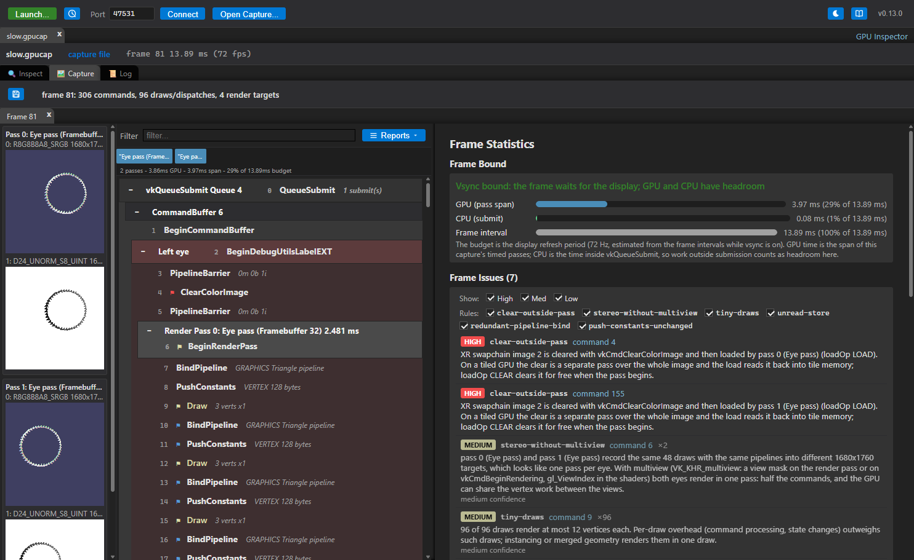
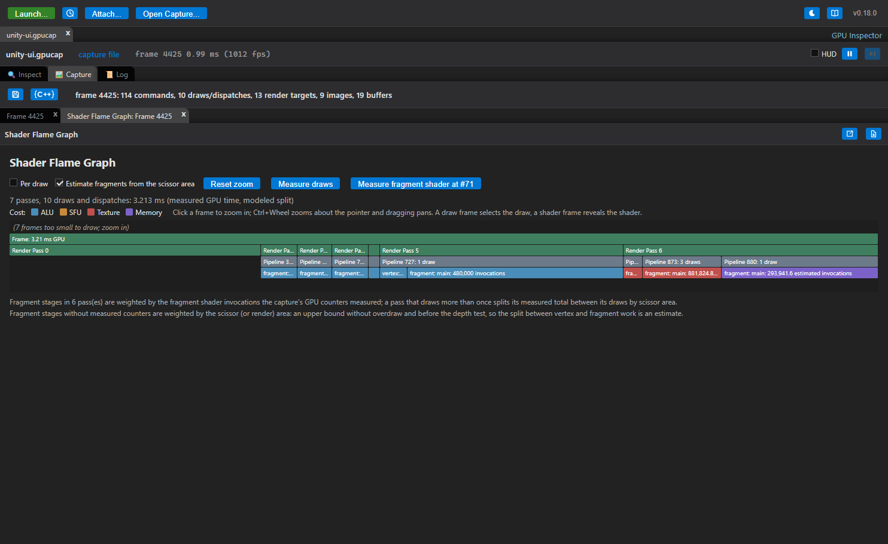
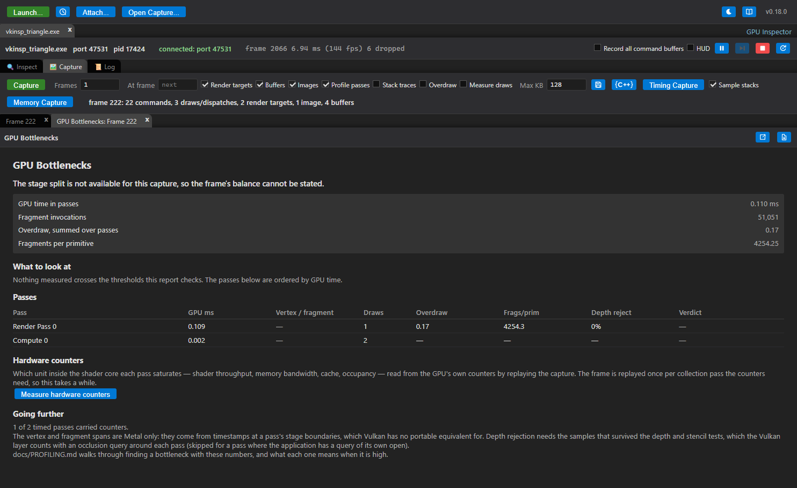
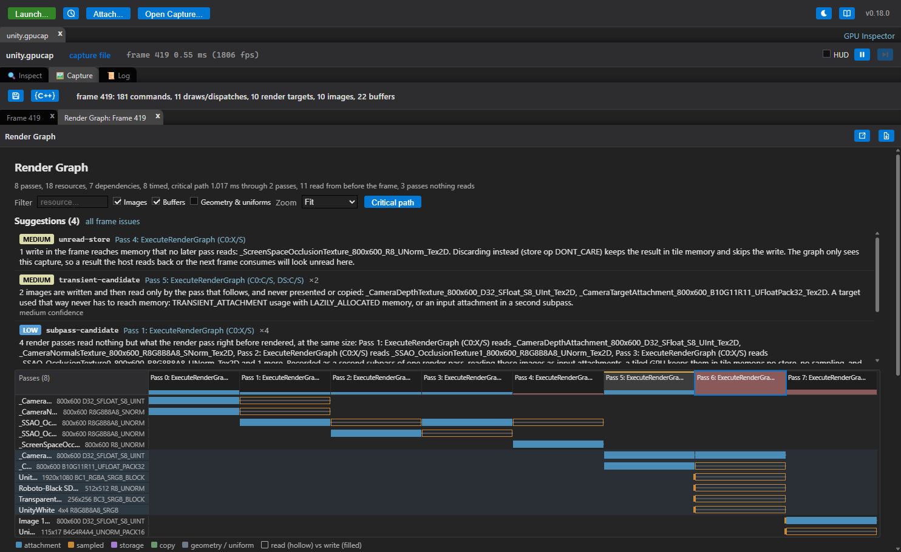
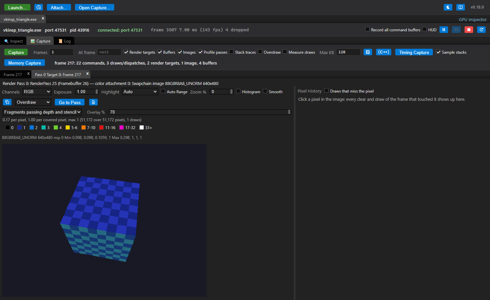
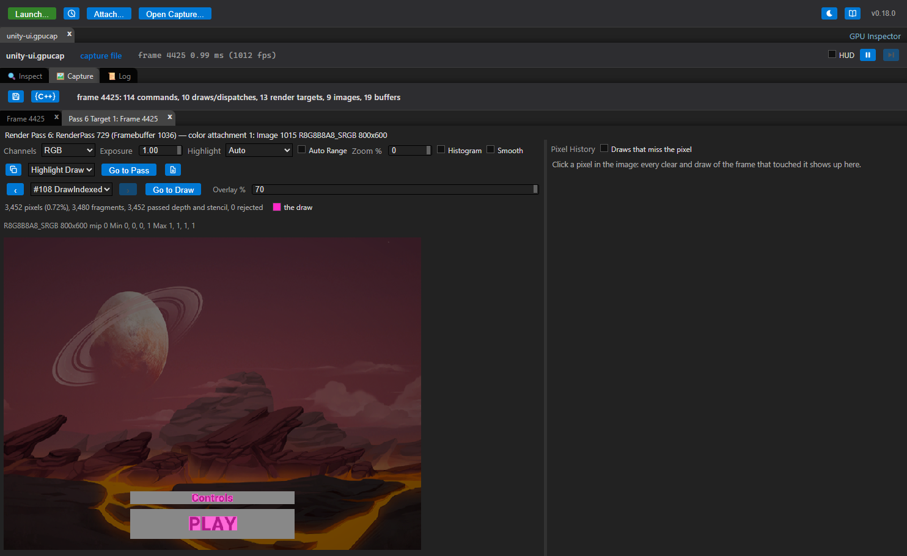
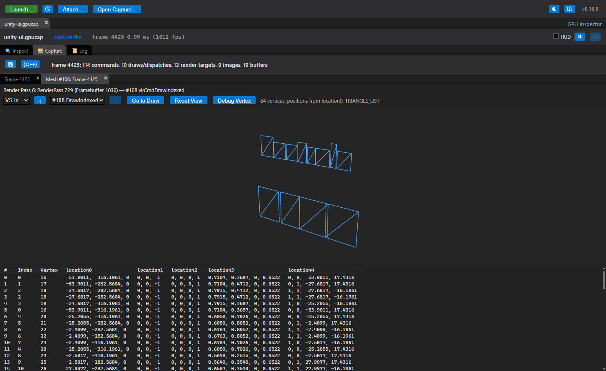
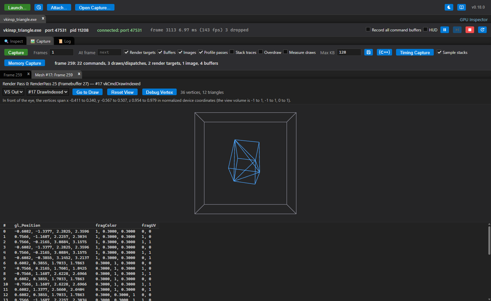
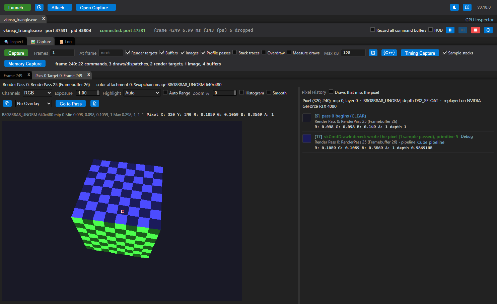
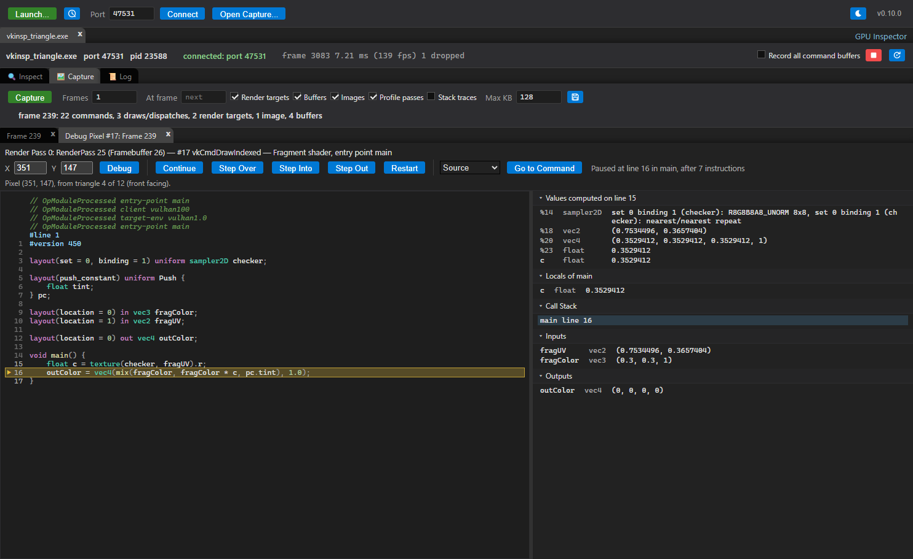

# Reports

[Docs index](README.md) › Reports

The **Reports** menu in a capture answers questions about the whole frame instead of one command.
Every report links back into the command list, so a number you want to understand is one click
from the draw that produced it.

Some answers are about one render target or one draw rather than the whole frame. They open in
tabs beside the capture's own: the [render target tab](#the-render-target-tab) (overdraw, draw
overlays and pixel history), the [mesh view](#mesh-view) and the [shader debugger](#shader-debugger).

For the order to use them in when a frame is slow, see
[Finding GPU bottlenecks](PROFILING.md).

## Frame Stats

In order down the view:

- **Frame Bound** — the frame's GPU time next to the CPU submit time and the frame interval, with
  a verdict on which of them the frame is waiting for. This is the first thing to read: it says
  whether the GPU is the problem at all. One verdict is not a bottleneck: when the captured passes
  span *longer than the frame the application reaches without a capture*, the card reports the
  capture's own cost instead of naming a limiter. Capturing puts a timestamp, statistics and
  occlusion query around every pass and reads every render target back, so the captured frame is
  the more expensive one — and a frame cannot be shorter than the GPU work it waits for, so the two
  bars are not on the same footing and no honest verdict can be drawn from them. Take the GPU
  figures from it as relative costs between passes, not as the frame's budget.
- **Where the CPU went** — the frame's CPU time split into submitting, waiting for the GPU,
  waiting for the display, and the application's own work.
- **Timeline** — the threads and the GPU drawn as tracks on one axis, which is the only view here
  that can show the GPU *idle*. See [when, not how much](PROFILING.md#step-1b-when-not-how-much).
- **Pass Timings** — each pass's GPU time, with the total and the span they cover.
- **Frame Statistics** — counts for the frame: commands by kind, draws (indexed, indirect, mesh),
  dispatches, submits and command buffers, passes and attachments, pipelines and stages bound,
  descriptor sets and what they bound, memory traffic and geometry.

**Frame Issues** lists what the frame analysis flagged — tiny draws, redundant binds, passes
without multiview on an XR frame, and the rest — each linked to the command it is about.
Severity checkboxes and a checkbox per rule narrow the list. The same findings appear inline on
the commands they concern.

## Analyze Shaders

Static analysis of every shader the frame's draws and dispatches used, worst first. It reads the
SPIR-V directly, so no shader source is needed.

For each shader: an estimated cost broken into ALU, special functions, texture and memory
operations, weighted by loop nesting; the costliest source lines when the shader carries debug
information; and findings for the patterns that usually matter — texture samples and atomics in
loops, expensive built-ins, non-constant and integer division, derivatives inside branches,
discards, loop-invariant work that could be hoisted.

## Shader Flame Graph

The frame's GPU work as a flame graph: pass, then pipeline, then shader stage, then function, then
source line. The pass level is measured time (from **Profile passes**); inside a pass the cost
model splits it across the draws and the functions they ran. It also lists the hottest functions
and lines of the frame. Clicking a frame zooms in; a draw frame selects the draw, and a shader
frame opens the shader.

Inside a pass, the split between draws is modelled until something measures it:

- **Profile passes** counters, where the capture has them, give each pass's fragment shader
  invocations, and the fragment stages are weighted by those instead of by scissor area.
- **Measure draws** (Vulkan) replays the capture on this machine's GPU with a timer and a pipeline
  statistics query around every draw. Each draw then takes its share of the pass by its measured
  time, and each stage its measured invocation count. The measurements are saved with the capture.
  They also fill in the depth rejection figure for passes whose draws are recorded into secondary
  command buffers, which the capture itself cannot measure (see
  [Finding GPU bottlenecks](PROFILING.md)).
- **Measure shader** (Vulkan) measures what a stage's functions, source lines and textures cost.
  It replays one draw of the stage with variants of its shader, each missing one part: a function's
  calls, a line's values, or every read of one texture. The time a variant saves is that part's
  cost. The button measures the stage of the selected frame, or the widest fragment or compute
  stage when nothing is selected. It works this way:
  - **Frames.** The stage's function and line frames are sized by their measured shares.
  - **List.** The graph lists every part with what it saved, textures included.
  - **Lines.** Taking a line out also takes out the work that only feeds it. A line's **own** time is
    therefore what it saved beyond the costliest measured part feeding it.
  - **Not measured.** Some parts are left out, and the list says why: values that decide a
    branch or a loop, a value a loop carries into its next iteration (removing it would let the
    compiler move the loop's work out), and lines of a module without line information.
  - **Precision.** Savings within the baseline's noise mean nothing.
  - **Saved.** The measurements are saved with the capture.

Use it to find which shader function is eating a pass, rather than which pass is eating the frame.

## GPU Bottlenecks

Every pass, measured in the terms a bottleneck is usually described in:

- GPU time
- how many times each pixel was shaded (overdraw)
- how large the triangles were (fragments per primitive)
- whether the depth test was rejecting work
- which stage the pass waits on

Each number is shown with what normally causes it. The counters come from a pipeline statistics
query on Vulkan and from Metal's counter sets on macOS; which of them are available depends on the
API and the GPU.

Once the hardware counters below have been read, the **Verdict** column shows what they measured
instead of what the rest of the report infers: the unit at its limit rather than a stage deduced
from overdraw and triangle size. On Vulkan this is usually the only verdict available at all, since
the vertex and fragment spans a stage verdict needs are Metal's.

**Hardware counters** at the foot of the report answer the question the rest of it can only infer:
which unit inside the shader core a pass actually saturates — shader throughput, memory bandwidth,
cache, occupancy, the ALU and FMA pipes. **Measure hardware counters** replays a Vulkan capture on
this machine's GPU reading its own counters around each render pass, and the numbers appear as a
column per counter beside each pass's GPU time. The frame is replayed once per collection pass the
counters need, so it takes a while on a large capture, and the result is kept with the capture and
saved into its file. It needs NVIDIA's Nsight Perf SDK or `VK_KHR_performance_query`, and GPU
performance-counter access enabled; [Capture replay](REPLAY.md#hardware-counters) has the detail.

[Finding GPU bottlenecks](PROFILING.md) is the walkthrough, including the thresholds each number
is judged against.

## Render Graph

The same frame as a dependency graph: every pass, the resources it reads and writes, and which
pass produced each of those. It is drawn as a resource lifetime chart, with the selected pass's
producers and consumers beside it.

It answers:

- why a pass is there at all, and what would break if it went
- what the frame reads from before the capture began
- which passes write something that nothing ever reads
- the frame's critical path

## The render target tab

**Open in Tab** under any of a pass's render targets (in a draw's details, or the pass's) shows the
target in a tab of its own: the image at any zoom on the left, and the history of whichever pixel
you click on the right. The **overlay list** in its toolbar draws over the image: **Overdraw**,
**Highlight Draw**, **Depth Test** or **Wireframe**. **Reports → Overdraw** opens it on the frame's
first measured pass with the overdraw on.

### Overdraw

How many fragments landed on each pixel, drawn over the pass's render target. Two numbers per
pass: fragments that passed the depth and stencil tests, and every rasterized fragment. Hovering
shows the counts under the pointer.

How it is measured depends on the API:

- **Vulkan** — pick **Overdraw** in the overlay list, or press **Measure Overdraw** in a pass's
  details. The capture is replayed on this machine's GPU, drawing each pass again with a counting
  shader. The application does not need to be running, but a GPU that can replay the capture does.
  See [Capture replay](REPLAY.md#overdraw).
- **Metal** — tick **Overdraw** in the capture bar before capturing. The measurement happens
  inside the captured frame.

The counting shader does not discard, so fragments the real shader would have thrown away are
still counted and alpha-tested geometry counts as opaque. A multiview pass is counted in its first
view only.

### Draw-call overlays

Where one draw landed, over its pass's render target: pick **Highlight Draw**, **Depth Test** or
**Wireframe** from the render target tab's overlay list, or press **Highlight Draw** under a draw's
render targets. The draw list beside it (with **‹** and **›**) steps through the pass's draws, and
**Go to Draw** selects the draw in the command list. Hovering a pixel says what the draw did there,
and the line under the list counts the pixels it covered, passed and had rejected.

- **Highlight Draw** — the draw's pixels in a flat colour, the rest of the image darkened.
- **Depth Test** — green where the draw's fragments passed the depth and stencil tests, red where
  they were rejected.
- **Wireframe** — the draw's triangles as lines.

Vulkan only: the capture is replayed on this machine's GPU with the draw drawn on its own (see
[Capture replay](REPLAY.md#draw-call-overlays)). As with overdraw, a fragment the draw's own shader
discards still shows as covered.

## Mesh view

A draw's mesh, as RenderDoc's Mesh Viewer shows it: press **View Mesh** in a draw's details. The tab
has a wireframe preview over a table of the draw's vertices:

- drag to turn the mesh, use the wheel to zoom, and double-click (or **Reset View**) to frame it again
- click a row of the table to mark that vertex in the preview
- the draw list steps through the pass's draws and keeps the view, so their meshes line up

- **VS In** — the vertices the draw read, decoded from the captured vertex and index buffers, with
  the attributes named from the vertex shader. The preview draws the attribute that looks like a
  position.
- **VS Out** — what the vertex shader wrote: `gl_Position` and every output, drawn in normalized
  device coordinates inside the outline of the view volume. The status line counts what keeps a
  mesh from being seen: primitives outside the view volume, vertices behind the eye, triangles with
  no area and NaN positions. Vulkan only: the capture is replayed with the vertex shader writing
  its outputs to a buffer (see [Capture replay](REPLAY.md#mesh-output)).

VS Out is the place to look when a draw ran but nothing appeared. A mesh entirely outside the
volume, or behind the eye, points at the matrices that placed it; triangles with no area at a scale
of zero; NaN positions at a uniform that was never set. `get_mesh_output` gives Claude the same.

### Pixel history

Click a pixel in the render target tab. The **Pixel History** pane beside it
lists every clear and draw that touched that pixel, in order, with what became of the draw's
fragments — not reached, culled, discarded, failed the depth test, failed the stencil test,
written — and the pixel's value and depth after each one.

This is the report for "why is this pixel the wrong colour".

- **Vulkan** — the capture is replayed on this machine's GPU, so the application need not be
  running.
- **Metal** — another frame is captured while following the pixel, so the application must still
  be running.

Current limits: writes outside render passes (copies, blits, compute) are not followed,
multisampled images are followed through their resolve attachment, and a draw is one event with no
detail per primitive inside it. The full list is in [Capture replay](REPLAY.md#pixel-history).

A draw's row has **Debug**, which opens the [shader debugger](#shader-debugger) on that draw's
fragment shader at the pixel.

## Shader debugger

One run of a shader, stepped through line by line, like RenderDoc's shader debugger. It shows the
values each line computed. Open it from:

- **Debug Vertex** or **Debug Pixel** in a draw's details. Debug Pixel starts on a pixel the draw
  covers.
- **Debug Invocation** in a dispatch's details.
- **Debug** on a draw in a [pixel history](#pixel-history), for that pixel.
- **Debug Vertex** in the [mesh view](#mesh-view), for the selected row.

- The toolbar icons are **Continue** (F5; **Pause** while running), **Step Over** (F10),
  **Step Into** (F11), **Step Out** (Shift+F11) and **Restart** (Ctrl+Shift+F5).
- Click a line number to set a breakpoint. Breakpoints are kept when you restart or pick another
  invocation of the same shader.
- The fields at the top pick the invocation: a vertex and instance, a pixel, or a compute
  invocation's `gl_GlobalInvocationID` (Metal: `thread_position_in_grid`).
- Hover over a name in the source to see its value.
- The side pane shows:
  - **Values computed**: every value the last line produced
  - **Locals** and **Call Stack**: click a frame to see its locals
  - **Inputs**, **Outputs**, **Globals** and **Resources** (uniform and storage blocks, push
    constants or bound buffers, textures and samplers)
  - **Warnings**: anything the debugger could not reproduce exactly
- When the shader returns, **Result** compares its outputs with what the GPU produced:
  - a vertex with the replay's outputs for that vertex (Vulkan)
  - a pixel with the render target's value after the pass

A Vulkan capture's shaders are SPIR-V, a Metal capture's are Metal Shading Language, and the tab is
the same for both.

The debugger steps by source line when the shader has its source: a Metal library always does (the
capture holds the text the application compiled), and SPIR-V does when it was compiled with line
information and its source is embedded (`-g`) or found under the launch dialog's Source roots.
SPIR-V without it steps by instruction through the disassembly instead; **Source** /
**Disassembly** switches between the two.

For SPIR-V without source, pick **Decompiled GLSL** instead of **Original SPIR-V** to step by
line anyway. `spirv-cross` decompiles the shader to GLSL with a variable for every value, named
after its SPIR-V id (`_42`), and `glslangValidator` compiles that back with line information. Both
come with the Vulkan SDK. The debugger then steps the recompiled module. It should compute the same
values, but it is not the module the GPU ran. So when it finishes, the original SPIR-V runs the same
invocation and **Original SPIR-V** in the side pane compares the two: every output by location and
built-in, or a compute shader's buffers by set and binding. If they differ, step the original.
Switching restarts the invocation and clears the breakpoints, since a line of one is not a line of
the other.

What it runs on:

- **A vertex**: the attributes decoded from the captured vertex buffers.
- **A pixel**: the vertex shader's outputs, interpolated at the pixel's centre from the front-most
  triangle covering it. The four pixels of its 2x2 quad run together, so derivatives and mip
  selection match a GPU. Where those outputs come from differs by API: a Vulkan draw is replayed
  (`vkinsp_replay`), and a Metal draw's vertex shader is run in the interpreter itself, which needs
  nothing built.
- **All three**: what the command had bound — a Vulkan draw's descriptor sets, push constants and
  specialization constants, a Metal draw's buffers, textures and samplers by index — with textures
  sampled from their read-backs.

Enable **Buffers** and **Images** before capturing. A buffer or image that was not captured reads as
zeros, and the Warnings section lists it.

Current limits:

- A Vulkan pixel needs `vkinsp_replay`.
- A Metal library the application loaded as a precompiled `metallib` has no source to step; one it
  compiled from source does.
- A Metal shader specialized with function constants is stepped with the values the draw used, and
  the Warnings section names any the capture did not record. A function constant that decides
  whether an *argument* exists is not honoured.
- A Metal fragment runs the draw's vertex shader once per vertex to find its triangle, so a draw
  with very many vertices is capped, and the notes say so.
- Tessellation and geometry stages (Metal: object, mesh and tile stages) are not supported.
- Multisampled pixels are shaded at the centre.
- An indirect dispatch's group counts read (1, 1, 1).
- A GPU driver may reorder floating-point operations the debugger performs in source order, so a
  value can differ in the last digits, or more where a shader cancels large numbers.

`debug_shader` gives Claude the same run, with every line's values in order, and `decompiled`
steps the decompiled GLSL with the same check against the original.

---

Previous: [Capture](CAPTURE.md) · [Docs index](README.md) · Next: [Finding GPU bottlenecks](PROFILING.md)
