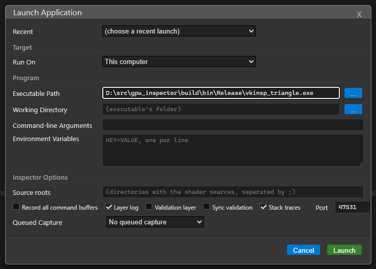

# Vulkan (Windows and Linux)

[Docs index](README.md) › Vulkan

Every Vulkan call is intercepted by a layer, so any Vulkan application can be inspected as it is:
nothing has to be recompiled, linked against the inspector or modified. Unity Vulkan players are
the primary target.

For Vulkan on a phone or headset, see [Android and Quest](ANDROID.md). For macOS, see
[Metal](METAL.md).

## Launching an application

Press **Launch...**, keep *Run On* on **This computer**, choose the executable and press
**Launch**. The inspector sets the layer's environment variables for that process alone, so the
layer is never enabled system-wide or for anything else.

The dialog's fields:

| Field | What it is |
|---|---|
| **Executable Path** | The application to start |
| **Working Directory** | The directory it starts in. Some applications need their own |
| **Command-line Arguments** | Passed to the application |
| **Environment Variables** | `KEY=VALUE`, one per line, added to the application's environment |
| **Port** | The port the layer and the inspector talk over. Change it only if something else uses it |

### Inspector options

| Option | What it does | Cost |
|---|---|---|
| **Source roots** | Directories holding your shader sources, separated by `;`. See [Shader sources](#shader-sources) | none |
| **Record all command buffers** | Records every command buffer as it is built, so buffers that are recorded once and reused every frame still appear in captures | CPU time in the application |
| **Layer log** | Writes the layer's activity to the session's **Log** tab | small |
| **Validation layer** | Also enables the Khronos validation layer. Its errors and warnings are listed in the Inspect tab, linked to the objects they name | slows the application |
| **Sync validation** | With the validation layer: reports synchronization hazards between commands and between submissions | slow |
| **Stack traces** | Records the call stack of every object creation, shown in the object's details | a few microseconds per object |

### Queued capture

**Queued Capture** takes a capture automatically as soon as the application connects, without you
pressing anything: *Capture frame* `N` captures that frame (0 is the first frame the inspector
sees), *Capture after seconds* waits that long first. Use it for a frame that has already gone by
before you can reach the Capture tab.

## Applications the inspector cannot start

An editor, or a game behind its own launcher, can still be inspected.

1. In the launch dialog, choose **An application started elsewhere (implicit layer)** under
   *Run On*.
2. Press **Register**. The layer is registered for your user account as an implicit layer.
   Nothing loads it until an application asks for it.
3. Press **Wait**.
4. Start the application with these environment variables set:

   | Variable | Value |
   |---|---|
   | `VKINSP_ENABLE` | `1` |
   | `VKINSP_PORT` | the port shown in the dialog |
   | `VKINSP_LOG_FILE` | optional: a path for the layer's log, since the inspector cannot read the output of a process it did not start |

5. The session connects when the application starts.

For an application started by a launcher, set the variables for your account (`setx` on Windows)
and restart the launcher. **Unregister** removes the registration when you are done.

From the command line: `npm start -- --wait-for-app --port=<port>`, and
`--implicit-layer=on|off` switches the registration.

## Connecting to a running application

An application already running with the layer enabled is picked up by entering its port in the
launch bar and pressing **Connect**.

## Shader sources

Shaders compiled with source-level debug information carry their own text, and the Source view,
the per-line costs and the findings' line links use it:

- `glslc -g` and `glslangValidator -g`
- `dxc -fspv-debug=vulkan-with-source`

A shader compiled with line information only (`dxc -Zi`, or a build that strips the text) names
its source file instead. **Source roots** in the launch dialog tells the inspector which
directories to read those files from on this machine.

Without either, shaders are still shown as SPIR-V disassembly, GLSL or HLSL, decompiled with
`spirv-dis` and `spirv-cross`. See [Editing a shader](INSPECT.md#editing-a-shader) for changing a
shader in the running application.

## Where the layer comes from

The app looks for `VK_LAYER_INSPECTOR_capture.json` next to a packaged app, and in `build/bin` and
`build/bin/{Release,RelWithDebInfo,Debug}` of a source checkout. If your build directory is
elsewhere, point `INSPECTOR_LAYER_DIR` at the directory holding the manifest and the layer library.

## If it does not work

See [Troubleshooting](TROUBLESHOOTING.md#vulkan), especially "The target starts but never
connects".

---

Previous: [Getting started](GETTING_STARTED.md) · [Docs index](README.md) · Next: [Metal](METAL.md)
